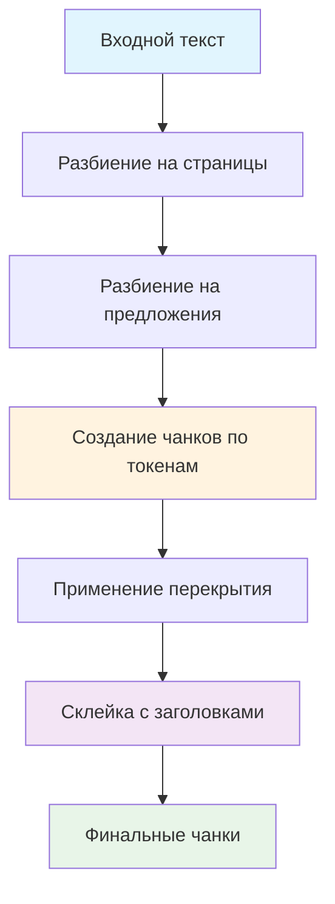

# 🎯 Гранулярное чанкование документов

## 📋 Обзор

Реализована система гранулярного чанкования документов с улучшенной логикой для нормативных документов. Система обеспечивает:

- **Гранулярность**: 512-1200 токенов на чанк
- **Скользящее окно**: ±15-30% перекрытие между чанками
- **Склейка с заголовками**: Предотвращение обрыва цитат и контекста
- **Адаптивность**: Различные настройки для разных типов документов

## 🏗️ Архитектура

### Основные компоненты

1. **Конфигурация чанкования** (`config/chunking_config.py`)
2. **Логика чанкования** (`services/ollama_rag_service.py`)
3. **Тестирование** (`test_granular_chunking.py`)

### Алгоритм работы



## ⚙️ Конфигурация

### Базовые параметры

```python
CHUNKING_CONFIG = {
    'target_tokens': 800,      # Целевое количество токенов
    'min_tokens': 512,         # Минимальное количество токенов
    'max_tokens': 1200,        # Максимальное количество токенов
    'overlap_ratio': 0.2,      # Перекрытие между чанками (20%)
    'merge_enabled': True,     # Включить логику склейки
    'tokens_per_char': 4       # 1 токен ≈ 4 символа
}
```

### Специфичные настройки по типам документов

| Тип документа | Целевые токены | Перекрытие | Примечание |
|---------------|----------------|------------|------------|
| **ГОСТ** | 600 | 25% | Мелкие чанки, высокая точность |
| **СП** | 800 | 20% | Стандартный размер |
| **СНиП** | 1000 | 15% | Крупные чанки, меньше перекрытия |
| **Корпоративные** | 700 | 20% | Сбалансированный подход |

## 🔧 Функциональность

### 1. Разбиение на предложения

Система использует интеллектуальные паттерны для разбиения текста:

```python
sentence_patterns = [
    r'[.!?]+(?=\s+[А-ЯЁ\d])',  # Обычные предложения
    r'[.!?]+(?=\s+\d+\.)',      # Перед номерами пунктов
    r'[.!?]+(?=\s+[А-ЯЁ]\s)',  # Перед заголовками
    r'[.!?]+(?=\s*$)'           # В конце текста
]
```

### 2. Оценка токенов

Эвристический подход для оценки количества токенов:

```python
def _estimate_tokens(self, text: str, config: dict) -> int:
    tokens_per_char = config.get('tokens_per_char', 4)
    return max(1, len(text) // tokens_per_char)
```

### 3. Перекрытие между чанками

Система создает перекрытие для сохранения контекста:

```python
overlap_sentences = self._get_overlap_sentences(current_chunk, overlap_ratio, config)
```

### 4. Склейка с заголовками

Логика предотвращения обрыва цитат и контекста:

```python
def _should_merge_chunks(self, chunk1: str, chunk2: str, config: dict) -> bool:
    # Проверка незавершенных конструкций
    # Проверка заголовков
    # Проверка размера объединенного чанка
```

## 📊 Примеры работы

### Входной текст
```
Страница 1 из 3

СП 22.13330.2016 "Основания зданий и сооружений"

Глава 1. Общие положения

1.1. Настоящий свод правил устанавливает требования к проектированию оснований зданий и сооружений.

1.2. Основания должны обеспечивать надежность и долговечность зданий и сооружений.
```

### Результат чанкования
```
Чанк 1: ~800 токенов
- Содержит: Заголовок + пункты 1.1-1.2
- Перекрытие: Последнее предложение

Чанк 2: ~800 токенов  
- Содержит: Перекрытие + следующие пункты
- Перекрытие: Последние предложения
```

## 🧪 Тестирование

### Запуск тестов

```bash
python test_granular_chunking.py
```

### Тестируемые компоненты

1. **Конфигурация чанкования** - Валидация параметров
2. **Разбиение на предложения** - Корректность паттернов
3. **Оценка токенов** - Точность эвристики
4. **Гранулярное чанкование** - Интеграционное тестирование

## 🚀 Использование

### Базовое использование

```python
from services.ollama_rag_service import OllamaRAGService

# Создание RAG сервиса
rag_service = OllamaRAGService()

# Создание чанков
chunks = rag_service._split_page_into_chunks(text, chunk_size=1000)
```

### Настройка конфигурации

```python
from config.chunking_config import get_chunking_config

# Получение конфигурации для ГОСТ документов
config = get_chunking_config('gost')

# Валидация конфигурации
from config.chunking_config import validate_chunking_config
is_valid = validate_chunking_config(config)
```

## 📈 Преимущества

### 1. **Точность поиска**
- Гранулярные чанки обеспечивают более точное соответствие запросам
- Перекрытие сохраняет контекст между чанками

### 2. **Качество контекста**
- Склейка с заголовками предотвращает обрыв цитат
- Сохранение структурных элементов документа

### 3. **Адаптивность**
- Различные настройки для разных типов документов
- Конфигурируемые параметры чанкования

### 4. **Надежность**
- Fallback режим при ошибках
- Валидация конфигурации
- Подробное логирование

## 🔍 Мониторинг и отладка

### Логирование

Система предоставляет детальное логирование:

```
📝 [CHUNKING] Using config: target=800, min=512, max=1200, overlap=0.2
📝 [MERGE_HEADERS] Merged 5 chunks into 3 chunks
✅ [CHUNKING] Created 3 granular chunks
```

### Метрики

- Количество созданных чанков
- Размер каждого чанка в токенах
- Эффективность склейки
- Время обработки

## 🔮 Планы развития

### Краткосрочные
- [ ] Интеграция с tiktoken для точной оценки токенов
- [ ] Машинное обучение для оптимизации параметров
- [ ] Поддержка дополнительных языков

### Долгосрочные
- [ ] Автоматическая настройка параметров по типу документа
- [ ] Анализ качества чанков на основе обратной связи
- [ ] Интеграция с системами оценки релевантности

## 📚 Дополнительные материалы

- [Документация по RAG сервису](rag_service/README.md)
- [Схема обработки документов](document_processing_scheme.md)
- [Архитектура системы](FRONTEND_SYSTEM_ARCHITECTURE_SCHEME.md)

## 🤝 Вклад в проект

Для внесения изменений:

1. Создайте feature branch
2. Внесите изменения
3. Добавьте тесты
4. Обновите документацию
5. Создайте Pull Request

## 📞 Поддержка

При возникновении вопросов или проблем:

1. Проверьте логи системы
2. Запустите тесты
3. Создайте Issue с описанием проблемы
4. Приложите примеры входных данных и ошибок
