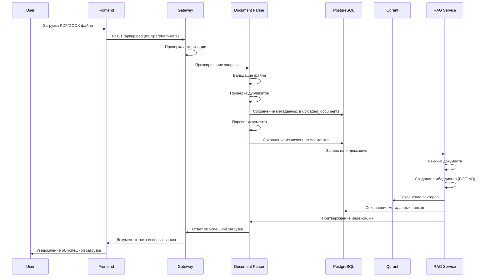
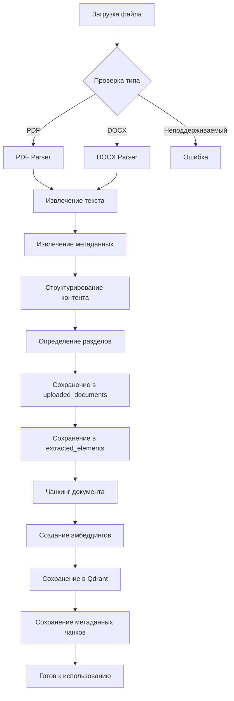
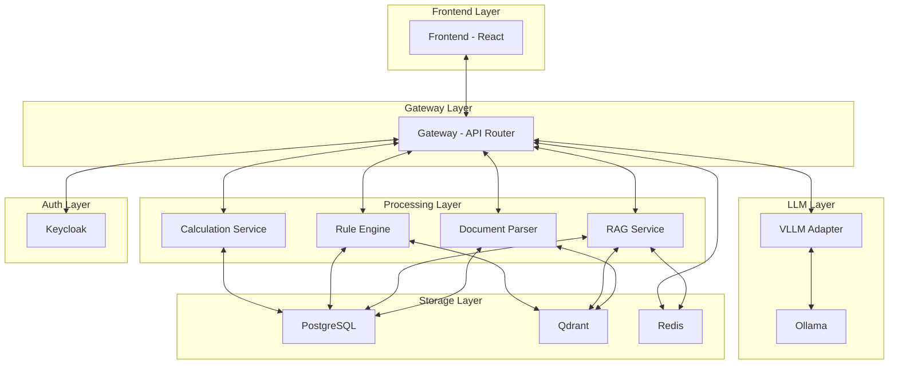
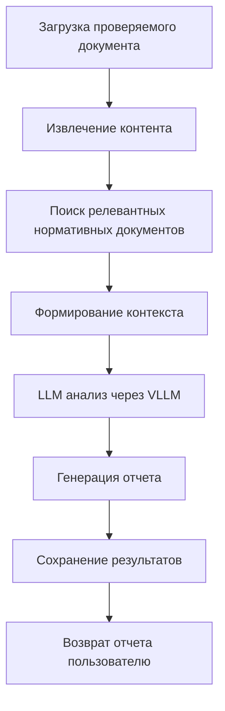
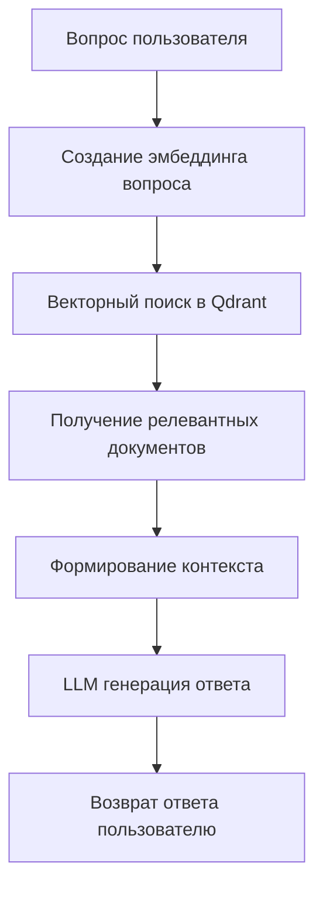
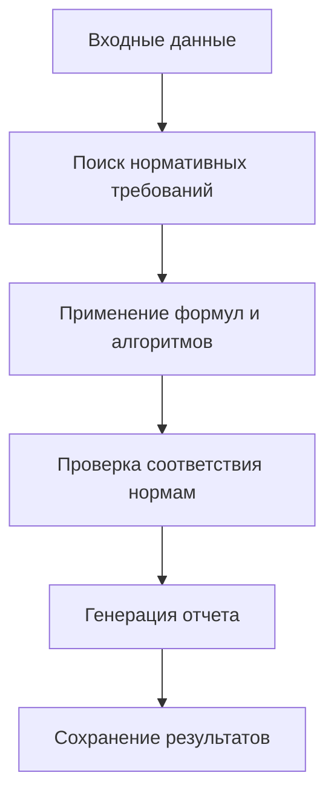
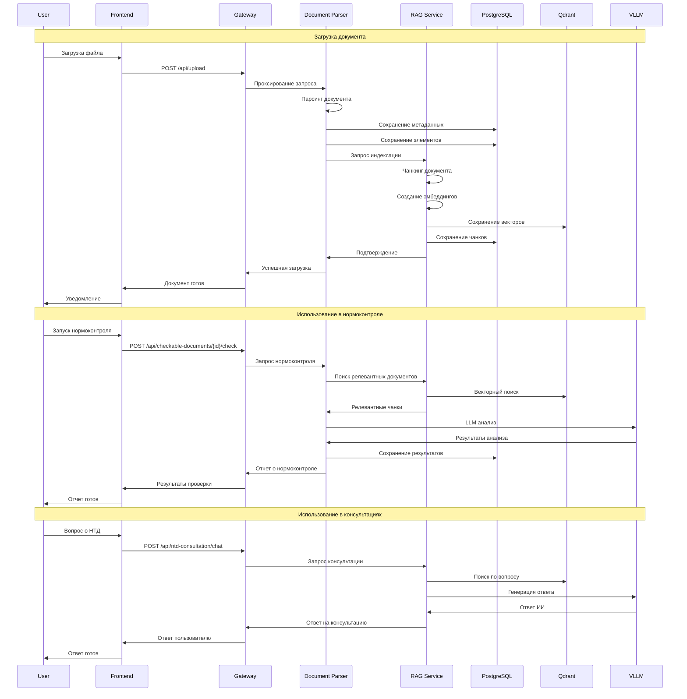

# Архитектура загрузки и обработки нормативных документов в AI-NK

## 🏗️ Общая архитектура системы

```
┌─────────────────┐    ┌─────────────────┐    ┌─────────────────┐    ┌─────────────────┐
│   Frontend      │    │   Gateway       │    │   Services      │    │   Databases     │
│   (React)       │◄──►│   (API Router)  │◄──►│   (Microservices)│◄──►│   (Storage)     │
└─────────────────┘    └─────────────────┘    └─────────────────┘    └─────────────────┘
        │                       │                       │                       │
        │                       │                       │                       │
        ▼                       ▼                       ▼                       ▼
┌─────────────────┐    ┌─────────────────┐    ┌─────────────────┐    ┌─────────────────┐
│   User Upload   │    │   Auth & Route  │    │   Processing    │    │   PostgreSQL    │
│   Interface     │    │   Requests      │    │   Pipeline      │    │   + Qdrant      │
└─────────────────┘    └─────────────────┘    └─────────────────┘    └─────────────────┘
```

## 🔄 Полный цикл обработки документа

### 1. Загрузка документа



### 2. Детальная схема обработки



## 🏢 Архитектура сервисов

### 1. Сервисы и их роли

| Сервис | Порт | Роль | Основные функции |
|--------|------|------|------------------|
| **Frontend** | 443 | Пользовательский интерфейс | Загрузка документов, просмотр результатов |
| **Gateway** | 8443 | API Gateway | Маршрутизация, авторизация, проксирование |
| **Document Parser** | 8001 | Обработка документов | Парсинг, извлечение контента, чанкинг |
| **RAG Service** | 8003 | Поиск и индексация | Векторный поиск, эмбеддинги, консультации |
| **Rule Engine** | 8002 | Проверки | Нормоконтроль, валидация |
| **Calculation Service** | 8004 | Расчеты | Инженерные расчеты |
| **VLLM** | 8000 | LLM API | Генерация ответов, анализ |
| **Ollama** | 11434 | LLM Backend | Локальные модели |
| **PostgreSQL** | 5432 | Реляционная БД | Метаданные, результаты |
| **Qdrant** | 6333 | Векторная БД | Векторный поиск |
| **Redis** | 6379 | Кэш | Сессии, кэширование |
| **Keycloak** | 8081 | Аутентификация | Управление пользователями |

### 2. Взаимодействие сервисов



## 📊 Структура данных

### 1. Таблицы PostgreSQL

#### `uploaded_documents` - Метаданные документов
```sql
CREATE TABLE uploaded_documents (
    id SERIAL PRIMARY KEY,
    original_filename VARCHAR(255) NOT NULL,
    filename VARCHAR(255) NOT NULL,
    file_type VARCHAR(20) NOT NULL,
    file_size BIGINT NOT NULL,
    upload_date TIMESTAMP DEFAULT CURRENT_TIMESTAMP,
    processing_status VARCHAR(50) DEFAULT 'pending',
    processing_error TEXT,
    document_hash VARCHAR(64) UNIQUE,
    category VARCHAR(50) DEFAULT 'other',
    document_type VARCHAR(50) DEFAULT 'normative',
    token_count INTEGER DEFAULT 0,
    file_path VARCHAR(500)
);
```

#### `extracted_elements` - Извлеченные элементы
```sql
CREATE TABLE extracted_elements (
    id SERIAL PRIMARY KEY,
    uploaded_document_id INTEGER REFERENCES uploaded_documents(id),
    element_type VARCHAR(50) NOT NULL,
    content TEXT NOT NULL,
    page_number INTEGER,
    section VARCHAR(255),
    element_order INTEGER,
    metadata JSONB
);
```

#### `normative_chunks` - Чанки для поиска
```sql
CREATE TABLE normative_chunks (
    id SERIAL PRIMARY KEY,
    document_id INTEGER REFERENCES uploaded_documents(id),
    chunk_id VARCHAR(255) UNIQUE NOT NULL,
    chunk_type VARCHAR(50) NOT NULL,
    content TEXT NOT NULL,
    page_number INTEGER,
    chapter VARCHAR(255),
    section VARCHAR(255),
    metadata JSONB,
    created_at TIMESTAMP DEFAULT CURRENT_TIMESTAMP
);
```

#### `norm_control_results` - Результаты нормоконтроля
```sql
CREATE TABLE norm_control_results (
    id SERIAL PRIMARY KEY,
    uploaded_document_id INTEGER REFERENCES uploaded_documents(id),
    check_date TIMESTAMP DEFAULT CURRENT_TIMESTAMP,
    status VARCHAR(50),
    findings JSONB,
    report_path VARCHAR(500),
    processing_time INTEGER
);
```

### 2. Коллекции Qdrant

#### `normative_documents` - Векторные представления
```python
# Структура точки в Qdrant
{
    "id": "chunk_id_hash",  # Числовой ID
    "vector": [0.1, 0.2, ...],  # 1024-мерный вектор BGE-M3
    "payload": {
        "document_id": 123,
        "code": "ГОСТ 21.201-2011",
        "title": "Полное название документа",
        "section_title": "Заголовок раздела",
        "content": "Текст чанка",
        "chunk_type": "paragraph",
        "page": 1,
        "section": "Область применения",
        "metadata": {
            "document_id": 123,
            "chunk_index": 1,
            "length": 150
        }
    }
}
```

## 🔧 Процесс обработки документов

### 1. Document Parser - Основной обработчик

```python
# document_parser/services/document_processing.py
class DocumentProcessor:
    def __init__(self):
        self.pdf_parser = PDFParser()
        self.docx_parser = DOCXParser()
        self.chunker = DocumentChunker()
    
    async def process_document(self, file_path: str, file_type: str) -> Dict:
        """Основной процесс обработки документа"""
        try:
            # 1. Парсинг документа
            if file_type == 'pdf':
                content = await self.pdf_parser.parse(file_path)
            elif file_type == 'docx':
                content = await self.docx_parser.parse(file_path)
            else:
                raise ValueError(f"Unsupported file type: {file_type}")
            
            # 2. Извлечение метаданных
            metadata = self.extract_metadata(file_path, content)
            
            # 3. Структурирование контента
            structured_content = self.structure_content(content)
            
            # 4. Сохранение в базу данных
            document_id = await self.save_to_database(metadata, structured_content)
            
            # 5. Чанкинг и индексация
            await self.index_document(document_id, structured_content)
            
            return {"status": "success", "document_id": document_id}
            
        except Exception as e:
            logger.error(f"Document processing error: {e}")
            return {"status": "error", "error": str(e)}
    
    def structure_content(self, content: str) -> List[Dict]:
        """Структурирование контента документа"""
        sections = []
        
        # Разбиение на разделы
        for section in self.extract_sections(content):
            elements = self.extract_elements(section)
            sections.append({
                "title": section.title,
                "elements": elements
            })
        
        return sections
    
    async def index_document(self, document_id: int, content: List[Dict]):
        """Индексация документа в RAG систему"""
        # Создание чанков
        chunks = self.chunker.create_chunks(content, document_id)
        
        # Сохранение чанков в базу
        await self.save_chunks(document_id, chunks)
        
        # Запрос на индексацию в RAG сервис
        await self.rag_service.index_document(document_id, chunks)
```

### 2. RAG Service - Векторный поиск

```python
# rag_service/services/rag_service.py
class RAGService:
    def __init__(self):
        self.embedding_model = SentenceTransformer('BAAI/bge-m3')
        self.qdrant_client = QdrantClient("http://qdrant:6333")
        self.db_manager = DatabaseManager()
    
    def index_document_chunks(self, document_id: int, chunks: List[Dict]) -> bool:
        """Индексация чанков документа в Qdrant"""
        try:
            points = []
            
            for chunk in chunks:
                # Создание эмбеддинга
                embedding = self.embedding_model.encode(chunk['content'])
                
                # Генерация ID для Qdrant
                qdrant_id = hash(f"{document_id}_{chunk['chunk_id']}") % (2**63 - 1)
                
                # Создание точки
                point = {
                    'id': qdrant_id,
                    'vector': embedding.tolist(),
                    'payload': {
                        'document_id': document_id,
                        'code': self.extract_document_code(chunk.get('document_title', '')),
                        'title': chunk.get('document_title', ''),
                        'section_title': chunk.get('section_title', ''),
                        'content': chunk.get('content', ''),
                        'chunk_type': chunk.get('chunk_type', 'paragraph'),
                        'page': chunk.get('page', 1),
                        'section': chunk.get('section', ''),
                        'metadata': chunk.get('metadata', {})
                    }
                }
                points.append(point)
            
            # Сохранение в Qdrant
            if points:
                self.qdrant_client.upsert(
                    collection_name="normative_documents",
                    points=points
                )
                
                logger.info(f"✅ Indexed {len(points)} chunks for document {document_id}")
                return True
            else:
                logger.warning(f"⚠️ No valid chunks to index for document {document_id}")
                return False
                
        except Exception as e:
            logger.error(f"❌ Indexing error: {e}")
            return False
    
    def hybrid_search(self, query: str, k: int = 8) -> List[Dict]:
        """Гибридный поиск по нормативным документам"""
        try:
            # Векторный поиск
            query_embedding = self.embedding_model.encode(query)
            vector_results = self.qdrant_client.search(
                collection_name="normative_documents",
                query_vector=query_embedding.tolist(),
                limit=k * 2
            )
            
            # BM25 поиск (если реализован)
            bm25_results = []
            
            # Объединение результатов
            combined_results = self.combine_search_results(
                vector_results, bm25_results, k
            )
            
            return combined_results
            
        except Exception as e:
            logger.error(f"❌ Search error: {e}")
            return []
```

## 🎯 Применение в функциональных модулях

### 1. Нормоконтроль документов



### 2. Консультации НТД



### 3. Инженерные расчеты



## 📈 Мониторинг и метрики

### 1. Prometheus метрики

```python
# Метрики для мониторинга
document_uploads_total = Counter('document_uploads_total', 'Total document uploads', ['file_type', 'status'])
document_processing_duration = Histogram('document_processing_duration_seconds', 'Document processing time')
chunks_created_total = Counter('chunks_created_total', 'Total chunks created', ['document_id'])
embeddings_created_total = Counter('embeddings_created_total', 'Total embeddings created')
search_requests_total = Counter('search_requests_total', 'Total search requests', ['service'])
search_duration = Histogram('search_duration_seconds', 'Search response time')
```

### 2. Health Checks

```python
# Health check для нормативных документов
@app.get("/health/normative-documents")
async def health_normative_documents():
    """Проверка состояния нормативных документов"""
    try:
        # Проверка PostgreSQL
        with db_connection.cursor() as cursor:
            cursor.execute("SELECT COUNT(*) FROM uploaded_documents")
            doc_count = cursor.fetchone()[0]
        
        # Проверка Qdrant
        collection_info = qdrant_client.get_collection("normative_documents")
        vector_count = collection_info.points_count
        
        return {
            "status": "healthy",
            "documents": {
                "postgresql_count": doc_count,
                "qdrant_count": vector_count,
                "sync_status": "ok" if doc_count > 0 and vector_count > 0 else "warning"
            }
        }
    except Exception as e:
        return {
            "status": "unhealthy",
            "error": str(e)
        }
```

## 🔄 Полный цикл обработки с временной диаграммой



## 📊 Статистика и отчеты

### 1. Статистика документов

```sql
-- Количество документов по типам
SELECT file_type, COUNT(*) as count 
FROM uploaded_documents 
GROUP BY file_type;

-- Размер документов
SELECT 
    AVG(file_size) as avg_size,
    MAX(file_size) as max_size,
    MIN(file_size) as min_size
FROM uploaded_documents;

-- Активность загрузки
SELECT 
    DATE(upload_date) as date,
    COUNT(*) as uploads
FROM uploaded_documents 
GROUP BY DATE(upload_date)
ORDER BY date DESC;
```

### 2. Статистика использования

```sql
-- Популярные документы в поиске
SELECT 
    nc.document_id,
    ud.original_filename,
    COUNT(*) as search_count
FROM normative_chunks nc
JOIN uploaded_documents ud ON nc.document_id = ud.id
GROUP BY nc.document_id, ud.original_filename
ORDER BY search_count DESC;
```

## 🎯 Заключение

Данная архитектура обеспечивает:

1. **Полный цикл обработки** - от загрузки до готовности к использованию
2. **Масштабируемость** - микросервисная архитектура
3. **Надежность** - резервирование и мониторинг
4. **Производительность** - оптимизированные компоненты
5. **Гибкость** - модульная структура

Система обеспечивает эффективную работу с нормативными документами для автоматизации процессов нормоконтроля и предоставления консультаций на основе ИИ.
