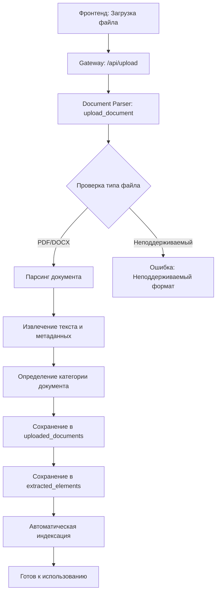
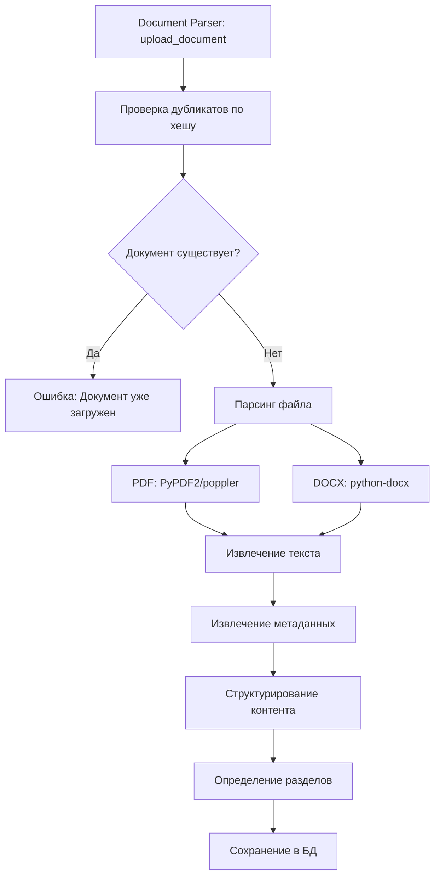
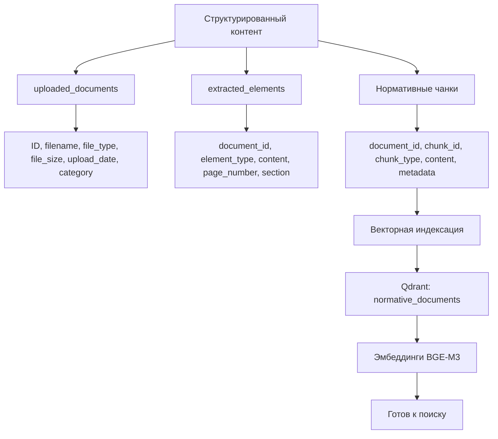
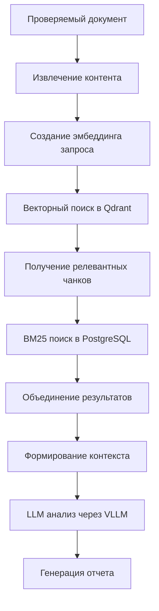
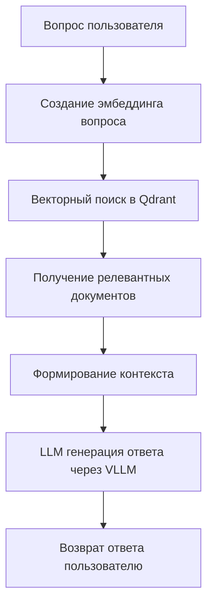
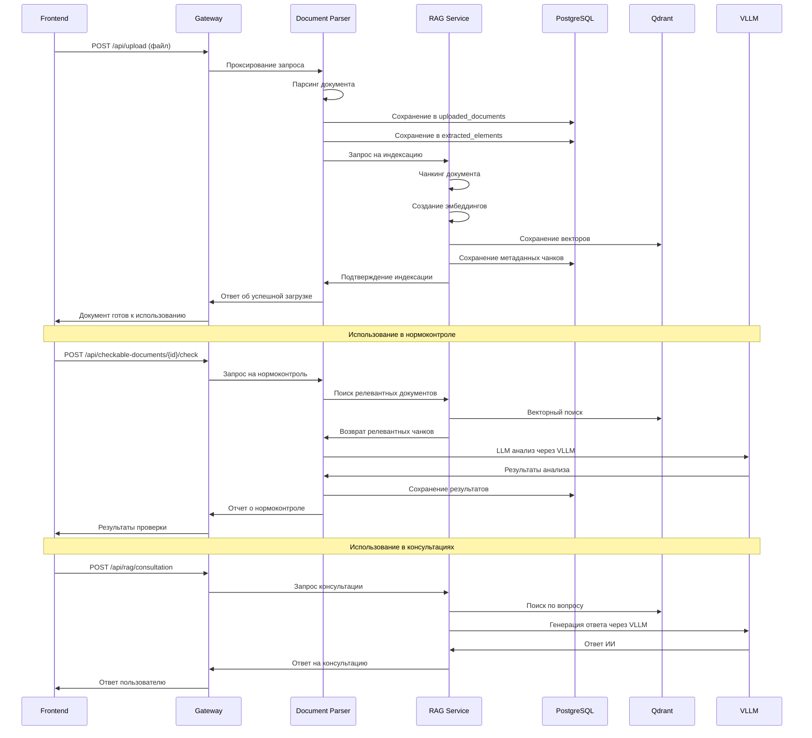

# Схема работы с нормативным документом

## 📋 Общий процесс обработки

```
┌─────────────────┐    ┌─────────────────┐    ┌─────────────────┐    ┌─────────────────┐
│   Загрузка      │───▶│   Парсинг       │───▶│   Индексация    │───▶│   Готовность    │
│   документа     │    │   контента      │    │   для поиска    │    │   к применению  │
└─────────────────┘    └─────────────────┘    └─────────────────┘    └─────────────────┘
```

## 🔄 Детальная схема обработки

### 1. Загрузка документа



### 2. Парсинг контента



### 3. Сохранение в базу данных



## 🏗️ Архитектура хранения данных

### 1. Таблицы PostgreSQL

#### `uploaded_documents`
```sql
CREATE TABLE uploaded_documents (
    id SERIAL PRIMARY KEY,
    original_filename VARCHAR(255) NOT NULL,
    file_type VARCHAR(50) NOT NULL,
    file_size BIGINT NOT NULL,
    upload_date TIMESTAMP DEFAULT CURRENT_TIMESTAMP,
    category VARCHAR(100),
    processing_status VARCHAR(50) DEFAULT 'completed',
    document_hash VARCHAR(64) UNIQUE
);
```

#### `extracted_elements`
```sql
CREATE TABLE extracted_elements (
    id SERIAL PRIMARY KEY,
    document_id INTEGER REFERENCES uploaded_documents(id),
    element_type VARCHAR(50) NOT NULL,
    content TEXT NOT NULL,
    page_number INTEGER,
    section VARCHAR(255),
    element_order INTEGER,
    metadata JSONB
);
```

#### `normative_chunks`
```sql
CREATE TABLE normative_chunks (
    id SERIAL PRIMARY KEY,
    document_id INTEGER REFERENCES uploaded_documents(id),
    chunk_id VARCHAR(255) UNIQUE NOT NULL,
    chunk_type VARCHAR(50) NOT NULL,
    content TEXT NOT NULL,
    metadata JSONB,
    created_at TIMESTAMP DEFAULT CURRENT_TIMESTAMP
);
```

### 2. Векторная база Qdrant

#### Коллекция `normative_documents`
```python
# Создание коллекции
qdrant_client.create_collection(
    collection_name="normative_documents",
    vectors_config={
        "size": 1024,  # BGE-M3 размерность
        "distance": "Cosine"
    }
)

# Структура точки
{
    "id": "chunk_id",
    "vector": [0.1, 0.2, ...],  # 1024-мерный вектор
    "payload": {
        "document_id": 123,
        "chunk_type": "paragraph",
        "content": "текст чанка",
        "metadata": {...}
    }
}
```

## 🔍 Процесс индексации

### 1. Чанкинг документа

```python
# document_parser/services/document_processing.py
class DocumentProcessor:
    def chunk_document(self, content: str, document_id: int) -> List[Dict]:
        """Разбиение документа на чанки"""
        chunks = []
        
        # Разбиение на параграфы
        paragraphs = self.split_into_paragraphs(content)
        
        for i, paragraph in enumerate(paragraphs):
            if len(paragraph.strip()) > 50:  # Минимальная длина
                chunk = {
                    "chunk_id": f"doc_{document_id}_chunk_{i}",
                    "chunk_type": "paragraph",
                    "content": paragraph.strip(),
                    "metadata": {
                        "document_id": document_id,
                        "chunk_index": i,
                        "length": len(paragraph)
                    }
                }
                chunks.append(chunk)
        
        return chunks
```

### 2. Создание эмбеддингов

```python
# rag_service/embedding_service.py
class EmbeddingService:
    def __init__(self):
        self.model = SentenceTransformer('BAAI/bge-m3')
    
    def create_embeddings(self, chunks: List[Dict]) -> List[Dict]:
        """Создание эмбеддингов для чанков"""
        embeddings = []
        
        for chunk in chunks:
            # Создание эмбеддинга
            embedding = self.model.encode(chunk["content"])
            
            # Подготовка для Qdrant
            qdrant_point = {
                "id": chunk["chunk_id"],
                "vector": embedding.tolist(),
                "payload": {
                    "document_id": chunk["metadata"]["document_id"],
                    "chunk_type": chunk["chunk_type"],
                    "content": chunk["content"],
                    "metadata": chunk["metadata"]
                }
            }
            embeddings.append(qdrant_point)
        
        return embeddings
```

### 3. Сохранение в Qdrant

```python
# rag_service/rag_service.py
class NormRAGService:
    def index_document(self, document_id: int, chunks: List[Dict]):
        """Индексация документа в векторную базу"""
        try:
            # Создание эмбеддингов
            embedding_service = EmbeddingService()
            qdrant_points = embedding_service.create_embeddings(chunks)
            
            # Сохранение в Qdrant
            self.qdrant_client.upsert(
                collection_name="normative_documents",
                points=qdrant_points
            )
            
            # Сохранение метаданных в PostgreSQL
            self.save_chunks_metadata(document_id, chunks)
            
            logger.info(f"✅ Document {document_id} indexed successfully")
            
        except Exception as e:
            logger.error(f"❌ Indexing error: {e}")
            raise
```

## 🎯 Применение в нормоконтроле

### 1. Поиск релевантных документов



### 2. Процесс нормоконтроля

```python
# document_parser/services/norm_control_service.py
class NormControlService:
    async def perform_norm_control_check(self, document_id: int) -> Dict[str, Any]:
        """Выполнение нормоконтроля документа"""
        try:
            # Получение проверяемого документа
            checkable_doc = await self.get_checkable_document(document_id)
            
            # Поиск релевантных нормативных документов
            relevant_chunks = await self.find_relevant_normative_chunks(
                checkable_doc["content"]
            )
            
            # Формирование контекста для LLM
            context = self.build_normative_context(relevant_chunks)
            
            # Получение промпта из настроек
            prompt_template = await self.get_normcontrol_prompt_template()
            
            # Форматирование промпта
            formatted_prompt = prompt_template.format(
                document_content=checkable_doc["content"],
                normative_context=context
            )
            
            # LLM анализ через VLLM
            llm_response = await self.llm_analysis(formatted_prompt)
            
            # Парсинг результатов
            findings = self.parse_llm_response(llm_response)
            
            # Сохранение результатов
            result_id = await self.save_norm_control_result(document_id, findings)
            
            return {
                "status": "success",
                "result_id": result_id,
                "findings": findings
            }
            
        except Exception as e:
            logger.error(f"Norm control error: {e}")
            return {"status": "error", "error": str(e)}
    
    async def find_relevant_normative_chunks(self, content: str) -> List[Dict]:
        """Поиск релевантных нормативных чанков"""
        # Создание эмбеддинга запроса
        embedding_service = EmbeddingService()
        query_embedding = embedding_service.model.encode(content)
        
        # Векторный поиск в Qdrant
        search_results = self.qdrant_client.search(
            collection_name="normative_documents",
            query_vector=query_embedding.tolist(),
            limit=10,
            score_threshold=0.7
        )
        
        # Извлечение контента
        relevant_chunks = []
        for result in search_results:
            relevant_chunks.append({
                "content": result.payload["content"],
                "document_id": result.payload["document_id"],
                "score": result.score,
                "metadata": result.payload["metadata"]
            })
        
        return relevant_chunks
```

## 🤖 Применение в консультациях НТД

### 1. Процесс консультации



### 2. Реализация консультации

```python
# rag_service/ntd_consultation.py
class NTDConsultationService:
    async def generate_response(self, question: str, history: List[Dict] = None) -> str:
        """Генерация ответа на основе нормативных документов"""
        try:
            # Поиск релевантных документов
            relevant_chunks = await self.find_relevant_chunks(question)
            
            # Формирование контекста
            context = self.build_context(relevant_chunks)
            
            # Формирование промпта
            prompt = self.build_prompt(question, context, history)
            
            # Генерация ответа через VLLM
            response = await self.llm_generate_response(prompt)
            
            return response
            
        except Exception as e:
            logger.error(f"Consultation error: {e}")
            return "Произошла ошибка при генерации ответа."
    
    async def find_relevant_chunks(self, question: str) -> List[Dict]:
        """Поиск релевантных чанков для вопроса"""
        # Создание эмбеддинга вопроса
        embedding_service = EmbeddingService()
        question_embedding = embedding_service.model.encode(question)
        
        # Векторный поиск
        search_results = self.qdrant_client.search(
            collection_name="normative_documents",
            query_vector=question_embedding.tolist(),
            limit=5,
            score_threshold=0.6
        )
        
        # Подготовка результатов
        relevant_chunks = []
        for result in search_results:
            relevant_chunks.append({
                "content": result.payload["content"],
                "document_id": result.payload["document_id"],
                "score": result.score
            })
        
        return relevant_chunks
    
    def build_context(self, chunks: List[Dict]) -> str:
        """Формирование контекста из найденных чанков"""
        context_parts = []
        
        for chunk in chunks:
            context_parts.append(f"Документ {chunk['document_id']}: {chunk['content']}")
        
        return "\n\n".join(context_parts)
    
    async def llm_generate_response(self, prompt: str) -> str:
        """Генерация ответа через VLLM"""
        async with httpx.AsyncClient() as client:
            response = await client.post(
                f"{GATEWAY_URL}/llm/chat/completions",
                headers={"Authorization": f"Bearer {self.auth_token}"},
                json={
                    "model": "llama3.1:8b",
                    "messages": [
                        {
                            "role": "system",
                            "content": "Вы - эксперт по нормативным документам. Отвечайте на вопросы пользователей на основе предоставленного контекста."
                        },
                        {
                            "role": "user",
                            "content": prompt
                        }
                    ],
                    "temperature": 0.7,
                    "max_tokens": 2000
                },
                timeout=60.0
            )
            
            if response.status_code == 200:
                data = response.json()
                return data["choices"][0]["message"]["content"]
            else:
                raise Exception(f"LLM request failed: {response.status_code}")
```

## 📊 Мониторинг и метрики

### 1. Метрики обработки документов

```python
# Метрики Prometheus
document_uploads_total = Counter('document_uploads_total', 'Total document uploads', ['file_type', 'status'])
document_processing_duration = Histogram('document_processing_duration_seconds', 'Document processing time')
chunks_created_total = Counter('chunks_created_total', 'Total chunks created', ['document_id'])
embeddings_created_total = Counter('embeddings_created_total', 'Total embeddings created')
```

### 2. Health Check компонентов

```python
# Health check для нормативных документов
@app.get("/health/normative-documents")
async def health_normative_documents():
    """Проверка состояния нормативных документов"""
    try:
        # Проверка PostgreSQL
        with db_connection.cursor() as cursor:
            cursor.execute("SELECT COUNT(*) FROM uploaded_documents")
            doc_count = cursor.fetchone()[0]
        
        # Проверка Qdrant
        collection_info = qdrant_client.get_collection("normative_documents")
        vector_count = collection_info.points_count
        
        return {
            "status": "healthy",
            "documents": {
                "postgresql_count": doc_count,
                "qdrant_count": vector_count,
                "sync_status": "ok" if doc_count > 0 and vector_count > 0 else "warning"
            }
        }
    except Exception as e:
        return {
            "status": "unhealthy",
            "error": str(e)
        }
```

## 🔄 Полный цикл обработки

### Временная диаграмма



## 📈 Статистика и отчеты

### 1. Статистика документов

```sql
-- Количество документов по типам
SELECT file_type, COUNT(*) as count 
FROM uploaded_documents 
GROUP BY file_type;

-- Размер документов
SELECT 
    AVG(file_size) as avg_size,
    MAX(file_size) as max_size,
    MIN(file_size) as min_size
FROM uploaded_documents;

-- Активность загрузки
SELECT 
    DATE(upload_date) as date,
    COUNT(*) as uploads
FROM uploaded_documents 
GROUP BY DATE(upload_date)
ORDER BY date DESC;
```

### 2. Статистика использования

```sql
-- Популярные документы в поиске
SELECT 
    nd.document_id,
    ud.original_filename,
    COUNT(*) as search_count
FROM normative_chunks nc
JOIN uploaded_documents ud ON nc.document_id = ud.id
JOIN search_logs sl ON nc.chunk_id = sl.chunk_id
GROUP BY nd.document_id, ud.original_filename
ORDER BY search_count DESC;
```

## Заключение

Данная схема обеспечивает полный цикл обработки нормативных документов:

1. **Загрузка и парсинг** - извлечение структурированного контента
2. **Индексация** - создание векторных представлений для поиска
3. **Хранение** - гибридное хранение в PostgreSQL и Qdrant
4. **Применение** - использование в нормоконтроле и консультациях
5. **Мониторинг** - отслеживание состояния и производительности

Система обеспечивает быстрый и точный поиск релевантных нормативных документов для автоматизации процессов нормоконтроля и предоставления консультаций на основе ИИ.

