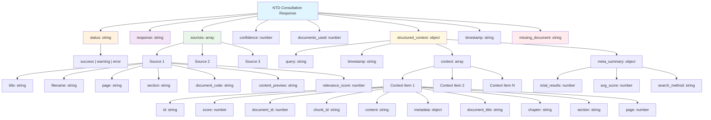
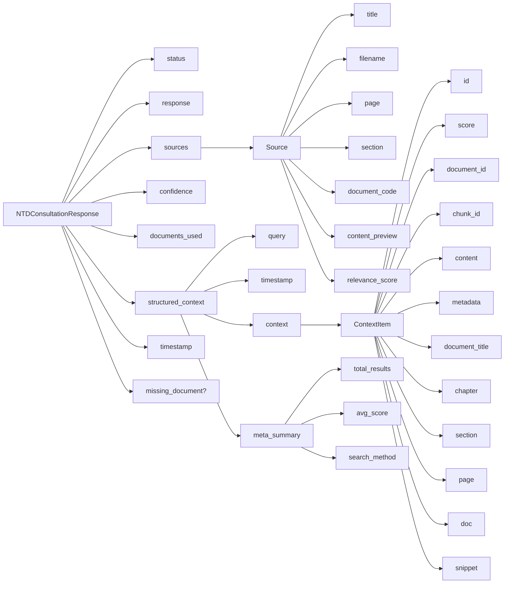
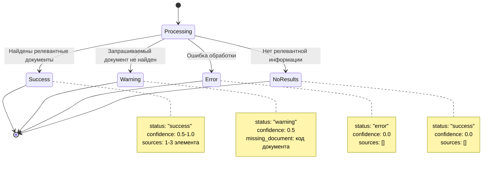
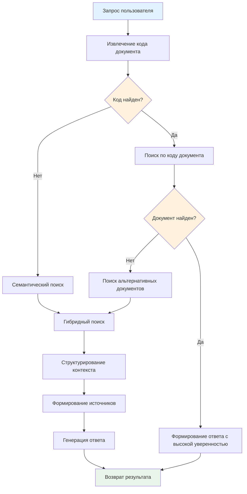

# Диаграмма структуры ответа "Консультация НТД"

## Mermaid диаграмма

```mermaid
graph TD
    A[NTD Consultation Response] --> B[status: string]
    A --> C[response: string]
    A --> D[sources: array]
    A --> E[confidence: number]
    A --> F[documents_used: number]
    A --> G[structured_context: object]
    A --> H[timestamp: string]
    A --> I[missing_document: string]
    
    B --> B1["success | warning | error"]
    
    D --> D1[Source 1]
    D --> D2[Source 2]
    D --> D3[Source 3]
    
    D1 --> D1A[title: string]
    D1 --> D1B[filename: string]
    D1 --> D1C[page: string]
    D1 --> D1D[section: string]
    D1 --> D1E[document_code: string]
    D1 --> D1F[content_preview: string]
    D1 --> D1G[relevance_score: number]
    
    G --> G1[query: string]
    G --> G2[timestamp: string]
    G --> G3[context: array]
    G --> G4[meta_summary: object]
    
    G3 --> G3A[Context Item 1]
    G3 --> G3B[Context Item 2]
    G3 --> G3C[Context Item N]
    
    G3A --> G3A1[id: string]
    G3A --> G3A2[score: number]
    G3A --> G3A3[document_id: number]
    G3A --> G3A4[chunk_id: string]
    G3A --> G3A5[content: string]
    G3A --> G3A6[metadata: object]
    G3A --> G3A7[document_title: string]
    G3A --> G3A8[chapter: string]
    G3A --> G3A9[section: string]
    G3A --> G3A10[page: number]
    
    G4 --> G4A[total_results: number]
    G4 --> G4B[avg_score: number]
    G4 --> G4C[search_method: string]
    
    style A fill:#e1f5fe
    style B fill:#fff3e0
    style C fill:#f3e5f5
    style D fill:#e8f5e8
    style G fill:#fff8e1
    style I fill:#ffebee
```

## JSON Schema диаграмма

```mermaid
graph LR
    A[NTDConsultationResponse] --> B[status]
    A --> C[response]
    A --> D[sources]
    A --> E[confidence]
    A --> F[documents_used]
    A --> G[structured_context]
    A --> H[timestamp]
    A --> I[missing_document?]
    
    D --> D1[Source]
    D1 --> D1A[title]
    D1 --> D1B[filename]
    D1 --> D1C[page]
    D1 --> D1D[section]
    D1 --> D1E[document_code]
    D1 --> D1F[content_preview]
    D1 --> D1G[relevance_score]
    
    G --> G1[query]
    G --> G2[timestamp]
    G --> G3[context]
    G --> G4[meta_summary]
    
    G3 --> G3A[ContextItem]
    G3A --> G3A1[id]
    G3A --> G3A2[score]
    G3A --> G3A3[document_id]
    G3A --> G3A4[chunk_id]
    G3A --> G3A5[content]
    G3A --> G3A6[metadata]
    G3A --> G3A7[document_title]
    G3A --> G3A8[chapter]
    G3A --> G3A9[section]
    G3A --> G3A10[page]
    G3A --> G3A11[doc]
    G3A --> G3A12[snippet]
    
    G4 --> G4A[total_results]
    G4 --> G4B[avg_score]
    G4 --> G4C[search_method]
```

## Схема состояний

```mermaid
stateDiagram-v2
    [*] --> Processing
    
    Processing --> Success: Найдены релевантные документы
    Processing --> Warning: Запрашиваемый документ не найден
    Processing --> Error: Ошибка обработки
    Processing --> NoResults: Нет релевантной информации
    
    Success --> [*]
    Warning --> [*]
    Error --> [*]
    NoResults --> [*]
    
    note right of Success
        status: "success"
        confidence: 0.5-1.0
        sources: 1-3 элемента
    end note
    
    note right of Warning
        status: "warning"
        confidence: 0.5
        missing_document: код документа
    end note
    
    note right of Error
        status: "error"
        confidence: 0.0
        sources: []
    end note
    
    note right of NoResults
        status: "success"
        confidence: 0.0
        sources: []
    end note
```

## Схема потока данных

```mermaid
flowchart TD
    A[Запрос пользователя] --> B[Извлечение кода документа]
    B --> C{Код найден?}
    
    C -->|Да| D[Поиск по коду документа]
    C -->|Нет| E[Семантический поиск]
    
    D --> F{Документ найден?}
    F -->|Да| G[Формирование ответа с высокой уверенностью]
    F -->|Нет| H[Поиск альтернативных документов]
    
    E --> I[Гибридный поиск]
    H --> I
    
    I --> J[Структурирование контекста]
    J --> K[Формирование источников]
    K --> L[Генерация ответа]
    L --> M[Возврат результата]
    
    G --> M
    
    style A fill:#e3f2fd
    style M fill:#e8f5e8
    style F fill:#fff3e0
    style C fill:#fff3e0
```
