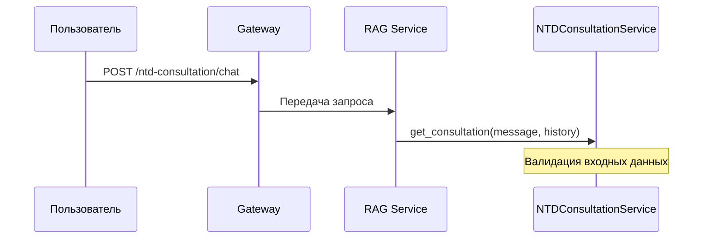
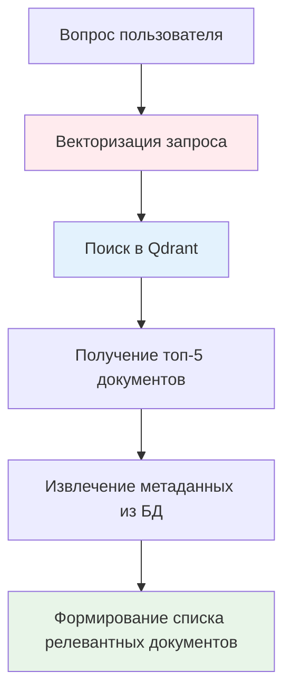
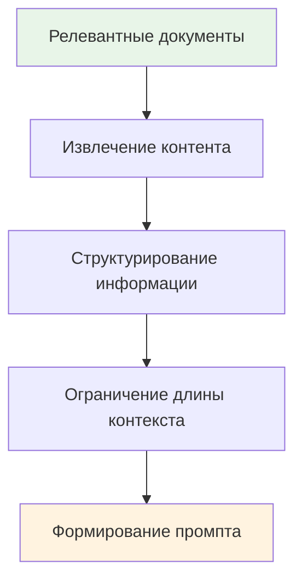
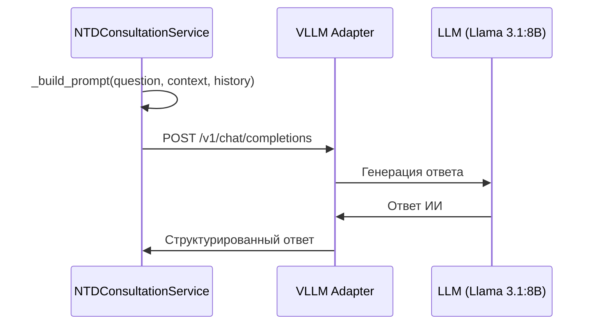
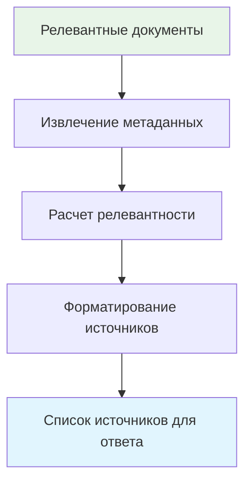
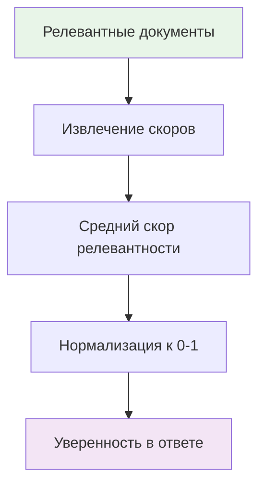

# Схема консультации НТД от ИИ

## 🔄 Общий процесс обработки запроса

```mermaid
graph TD
    A[Пользователь отправляет вопрос] --> B[API Gateway]
    B --> C[RAG Service - /ntd-consultation/chat]
    C --> D[NTDConsultationService.get_consultation()]
    D --> E[Поиск релевантных документов]
    E --> F[Формирование контекста]
    F --> G[Генерация ответа ИИ]
    G --> H[Подготовка источников]
    H --> I[Возврат ответа пользователю]
    
    style A fill:#e1f5fe
    style I fill:#e8f5e8
    style D fill:#fff3e0
    style G fill:#f3e5f5
```

## 📋 Детальная схема обработки

### 1. **Получение запроса**



**Входные данные:**
```json
{
  "message": "Какие требования к пожарной безопасности?",
  "history": [
    {"role": "user", "content": "Предыдущий вопрос"},
    {"role": "assistant", "content": "Предыдущий ответ"}
  ],
  "user_id": "user123"
}
```

### 2. **Поиск релевантных документов**



**Процесс поиска:**
```python
async def _search_relevant_documents(self, query: str, limit: int = 5):
    # 1. Векторизация запроса (заглушка)
    query_vector = self._get_query_vector(query)  # [0.1] * 1536
    
    # 2. Поиск в Qdrant
    search_results = self.qdrant_client.search(
        collection_name="normative_documents",
        query_vector=query_vector,
        limit=limit,
        with_payload=True
    )
    
    # 3. Обогащение метаданными
    documents = []
    for result in search_results:
        doc_info = await self._get_document_info(result.id)
        documents.append({
            "id": result.id,
            "score": result.score,
            "content": result.payload.get("content", ""),
            "title": doc_info.get("title", ""),
            "category": doc_info.get("category", ""),
            "page": result.payload.get("page", 1)
        })
    
    return documents
```

### 3. **Формирование контекста**



**Структура контекста:**
```python
def _build_context(self, documents: List[Dict[str, Any]]) -> str:
    context_parts = []
    
    for i, doc in enumerate(documents, 1):
        context_parts.append(f"Документ {i}: {doc['title']}")
        context_parts.append(f"Категория: {doc['category']}")
        context_parts.append(f"Содержание: {doc['content'][:500]}...")
        context_parts.append("---")
    
    return "\n".join(context_parts)
```

### 4. **Генерация ответа ИИ**



**Промпт для ИИ:**
```python
system_prompt = """Ты - эксперт по нормативным документам и стандартам. 
Твоя задача - давать точные и полезные ответы на вопросы пользователей, 
основываясь на предоставленных нормативных документах.

Правила:
1. Отвечай ТОЛЬКО на основе предоставленных документов
2. Если в документах нет информации для ответа, честно скажи об этом
3. Цитируй конкретные пункты документов, если это уместно
4. Давай практические рекомендации
5. Отвечай на русском языке
6. Будь точным и профессиональным

Контекст из нормативных документов:
{context}

История диалога:
{history}

Вопрос пользователя: {question}

Ответ:"""
```

**Запрос к VLLM:**
```json
{
  "model": "llama3.1:8b",
  "messages": [
    {
      "role": "system",
      "content": "Ты - эксперт по нормативным документам..."
    },
    {
      "role": "user", 
      "content": "Полный промпт с контекстом"
    }
  ],
  "temperature": 0.7,
  "max_tokens": 2000,
  "stream": false
}
```

### 5. **Подготовка источников**



**Структура источников:**
```python
def _prepare_sources(self, documents: List[Dict[str, Any]]) -> List[Dict[str, Any]]:
    sources = []
    
    for doc in documents:
        sources.append({
            "title": doc.get("title", "Неизвестный документ"),
            "filename": doc.get("filename", ""),
            "category": doc.get("category", ""),
            "page": doc.get("page", 1),
            "relevance_score": round(doc.get("score", 0), 3)
        })
    
    return sources
```

### 6. **Расчет уверенности**



**Алгоритм расчета:**
```python
def _calculate_confidence(self, documents: List[Dict[str, Any]]) -> float:
    if not documents:
        return 0.0
    
    # Средний скор релевантности
    avg_score = sum(doc.get("score", 0) for doc in documents) / len(documents)
    
    # Нормализация к диапазону 0-1
    confidence = min(avg_score, 1.0)
    
    return round(confidence, 3)
```

## 📤 Структура ответа

```json
{
  "status": "success",
  "response": "Согласно нормативным документам, требования к пожарной безопасности включают...",
  "sources": [
    {
      "title": "ГОСТ 12.1.004-91",
      "filename": "gost_12_1_004_91.pdf",
      "category": "gost",
      "page": 15,
      "relevance_score": 0.892
    },
    {
      "title": "СП 54.13330.2016",
      "filename": "sp_54_13330_2016.pdf", 
      "category": "sp",
      "page": 23,
      "relevance_score": 0.756
    }
  ],
  "confidence": 0.824,
  "documents_used": 2,
  "timestamp": "2025-08-28T19:45:30.123Z"
}
```

## 🔧 Технические детали

### **Компоненты системы:**

1. **NTDConsultationService** - основной сервис консультаций
2. **Qdrant** - векторная база данных для поиска
3. **PostgreSQL** - реляционная БД для метаданных
4. **VLLM Adapter** - адаптер для работы с LLM
5. **Llama 3.1:8B** - языковая модель для генерации ответов

### **Параметры конфигурации:**

```python
# Параметры поиска
SEARCH_LIMIT = 5  # Количество документов для поиска
CONTEXT_LENGTH = 500  # Максимальная длина контекста документа

# Параметры LLM
MODEL_NAME = "llama3.1:8b"
TEMPERATURE = 0.7
MAX_TOKENS = 2000

# Параметры векторизации
VECTOR_DIMENSION = 1536
```

### **Обработка ошибок:**

```python
try:
    # Основная логика
    result = await self.get_consultation(message, history)
except Exception as e:
    logger.error(f"❌ [NTD_CONSULTATION] Error: {e}")
    return {
        "response": "Произошла ошибка при обработке вашего запроса...",
        "sources": [],
        "confidence": 0.0,
        "error": str(e)
    }
```

## 📊 Метрики и мониторинг

### **Ключевые метрики:**
- Время обработки запроса
- Количество найденных документов
- Уверенность в ответе
- Количество использованных документов
- Статистика консультаций

### **Логирование:**
```python
logger.info(f"🔍 [NTD_CONSULTATION] Processing question: {message[:100]}...")
logger.info(f"✅ [NTD_CONSULTATION] Response generated successfully")
logger.error(f"❌ [NTD_CONSULTATION] Error: {e}")
```

## 🚀 Оптимизации и улучшения

### **Планируемые улучшения:**
1. **Реальная векторизация** - замена заглушки на BGE-M3
2. **Кэширование** - кэширование частых запросов
3. **Streaming** - потоковая генерация ответов
4. **Контекстное окно** - динамическое управление контекстом
5. **Многоязычность** - поддержка других языков

### **Мониторинг качества:**
- A/B тестирование промптов
- Сбор обратной связи пользователей
- Анализ релевантности источников
- Отслеживание уверенности в ответах

---

**Дата создания:** 28.08.2025  
**Статус:** 📋 СХЕМА ГОТОВА
