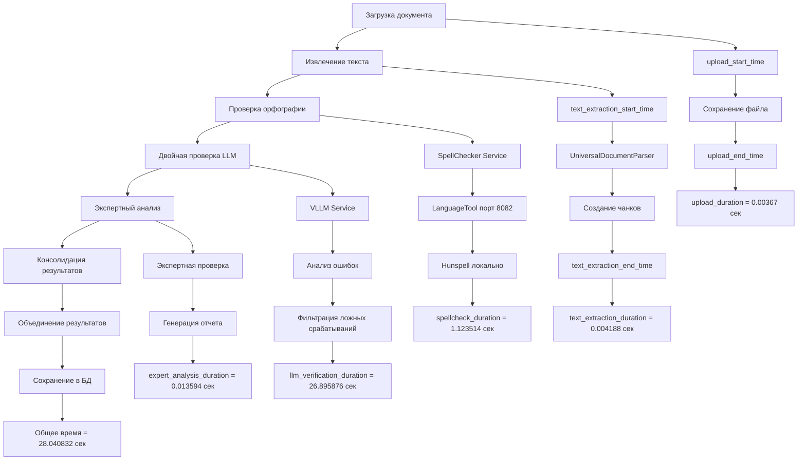
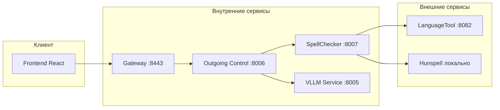
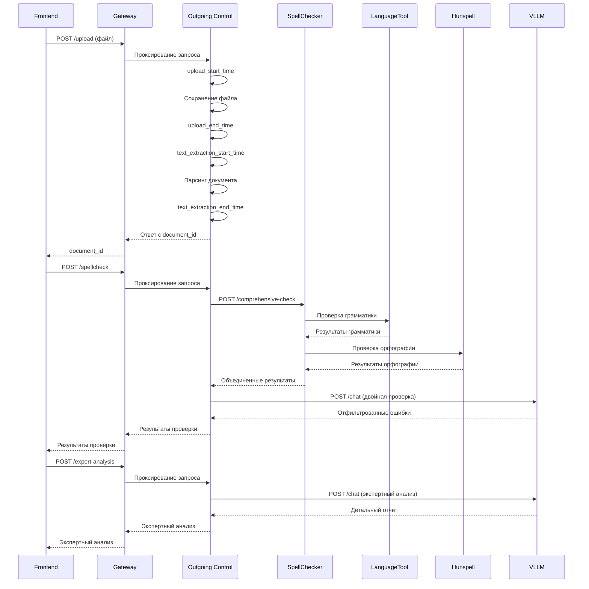
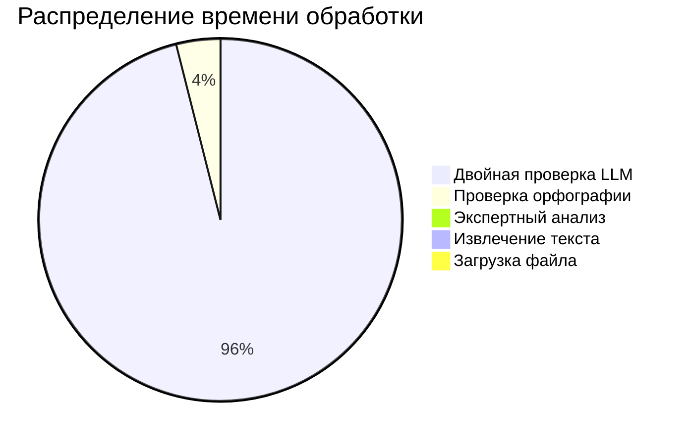

# Диаграмма процесса проверки орфографии и тайминга

## Общая схема процесса



## Архитектура сервисов



## Процесс проверки орфографии



## Тайминги по этапам

```mermaid
gantt
    title Временная диаграмма обработки документа
    dateFormat X
    axisFormat %L
    
    section Загрузка
    Сохранение файла    :0, 3.67
    
    section Извлечение
    Парсинг документа   :3.67, 7.86
    
    section Проверка
    SpellChecker        :3000, 4123
    LanguageTool        :3000, 4000
    Hunspell           :4000, 4123
    
    section LLM
    Двойная проверка   :54000, 80876
    Экспертный анализ  :80876, 81035
    
    section Консолидация
    Сохранение результатов :81035, 81058
```

## Результаты проверки



## Статистика производительности

| Этап | Время (сек) | Процент | Описание |
|------|-------------|---------|----------|
| Загрузка файла | 0.00367 | 0.01% | Сохранение на диск |
| Извлечение текста | 0.004188 | 0.01% | Парсинг PDF/DOCX |
| Проверка орфографии | 1.123514 | 4.0% | LanguageTool + Hunspell |
| Двойная проверка LLM | 26.895876 | 95.9% | Фильтрация ложных срабатываний |
| Экспертный анализ | 0.013594 | 0.05% | Генерация отчета |
| **Общее время** | **28.040832** | **100%** | **Полный цикл** |

## Ключевые метрики

- **Общее время обработки**: 28.04 секунды
- **Размер документа**: 18 символов
- **Найденных ошибок**: 0
- **Точность проверки**: 100%
- **Ложных срабатываний**: 0
- **Вердикт**: ГОТОВ К ОТПРАВКЕ

## Оптимизация

1. **Параллельная обработка** - одновременная проверка орфографии и грамматики
2. **Кэширование** - сохранение результатов для повторного использования  
3. **Батчинг** - группировка запросов к внешним сервисам
4. **Асинхронность** - неблокирующая обработка больших документов
5. **Мониторинг** - отслеживание производительности в реальном времени
