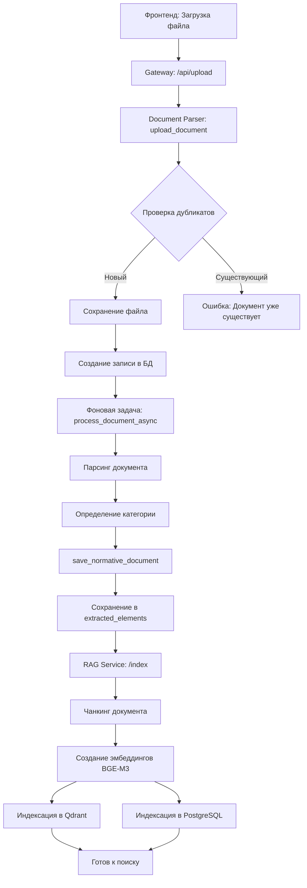
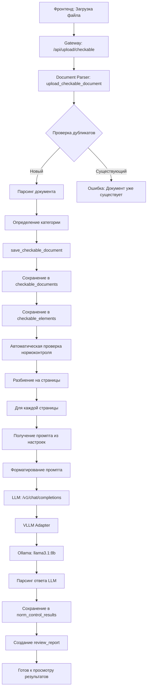
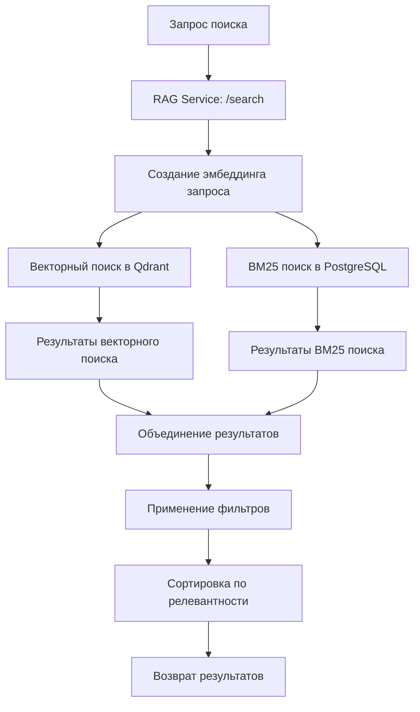
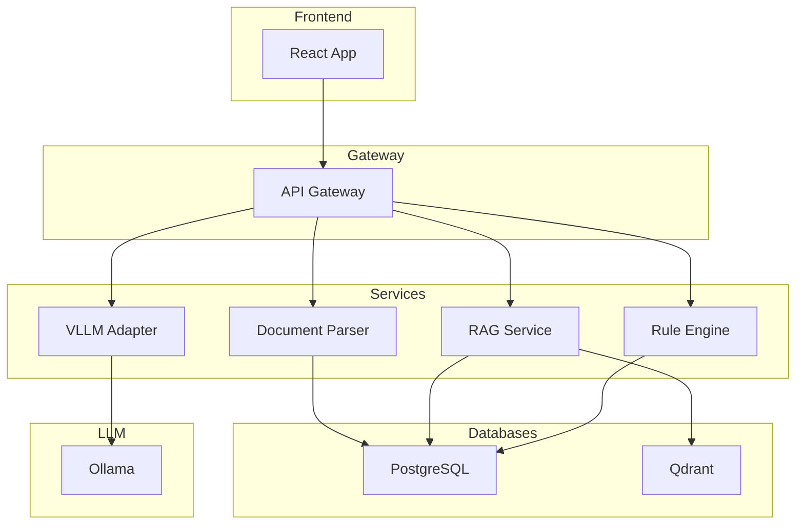
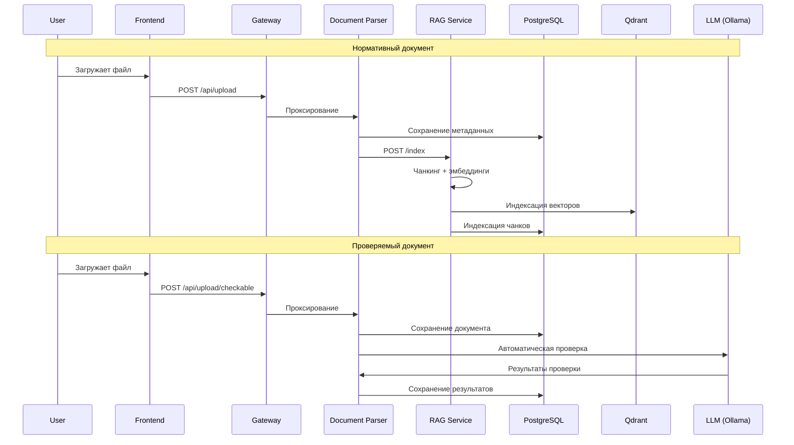
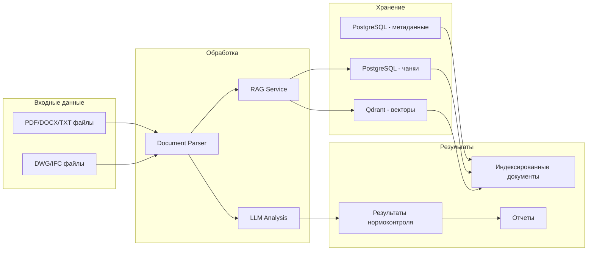

# Диаграмма потоков обработки документов

## 1. Нормативный документ

## 2. Проверяемый документ

## 3. Поиск по нормативным документам

## 4. Архитектура системы

## 5. Поток данных в системе

## 6. Компоненты и их взаимодействие

