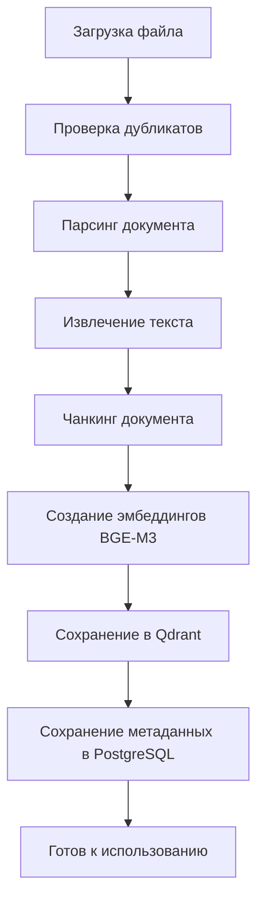
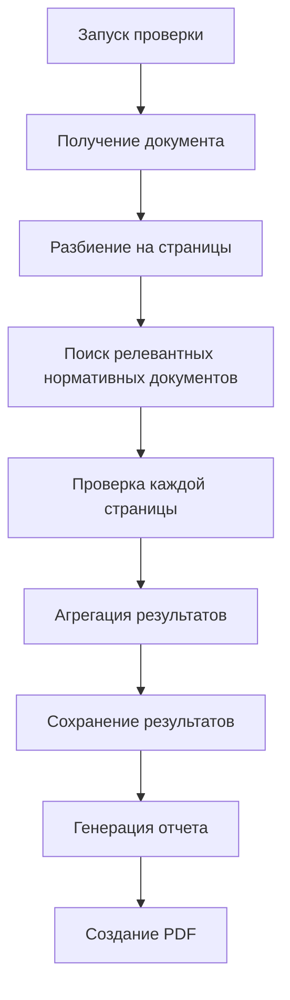

# Детальное описание работы проекта AI-NK в части проведения нормоконтроля

## 📋 Общий обзор системы AI-NK

Система AI-NK (AI Norm Control) представляет собой интеллектуальную платформу для автоматизированной проверки проектной документации на соответствие нормативным требованиям в строительстве и проектировании. Система использует гибридный подход, сочетающий RAG (Retrieval-Augmented Generation), векторный поиск и LLM (Large Language Models) для точного анализа документов.

## 🏗️ Архитектура системы

### Основные компоненты:
- **Document Parser** - парсинг и обработка документов
- **RAG Service** - поиск по нормативной базе
- **Rule Engine** - правила и логика проверки
- **VLLM Service** - языковые модели для анализа
- **Gateway** - API шлюз
- **Frontend** - веб-интерфейс
- **PostgreSQL** - основная база данных
- **Qdrant** - векторная база данных

## 📚 1. Загрузка нормативных документов и обучение системы

### 1.1 Структура нормативной базы

Система поддерживает следующие категории нормативных документов:
- **ГОСТ** - государственные стандарты
- **СП** - своды правил
- **СНиП** - строительные нормы и правила
- **Ведомственные** - ведомственные нормативы

### 1.2 Процесс загрузки нормативных документов

#### Шаг 1: Подготовка документов
```
TestDocs/Norms/
├── ГОСТ/
│   ├── ГОСТ 21.501-2018 - Правила выполнения архитектурно-строительных чертежей.pdf
│   ├── ГОСТ 21.502-2016 - Правила выполнения конструкторских чертежей.pdf
│   └── ГОСТ 2.306-68 - Обозначения графические материалов.pdf
├── СП/
│   ├── СП 48.13330.2019 - Организация строительства.pdf
│   └── СП 70.13330.2012 - Несущие и ограждающие конструкции.pdf
├── СНиП/
│   ├── СНиП 2.01.07-85 - Нагрузки и воздействия.pdf
│   └── СНиП 3.03.01-87 - Несущие и ограждающие конструкции.pdf
└── Ведомственные/
    ├── РД 11-02-2006 - Требования к составу и порядку ведения исполнительной документации.pdf
    └── СП 48.13330.2019 - Организация строительства.pdf
```

#### Шаг 2: Загрузка через интерфейс
1. Открытие страницы "Нормативные документы"
2. Выбор категории документа
3. Загрузка файла (PDF, DOCX, TXT)
4. Автоматическая обработка и индексация

#### Шаг 3: Процесс индексации


### 1.3 Техническая реализация индексации

#### Чанкинг документа:
```python
def chunk_document(self, content: str, document_id: int) -> List[Dict]:
    """Разбиение документа на чанки"""
    chunks = []
    paragraphs = self.split_into_paragraphs(content)
    
    for i, paragraph in enumerate(paragraphs):
        if len(paragraph.strip()) > 50:  # Минимальная длина
            chunk = {
                "chunk_id": f"doc_{document_id}_chunk_{i}",
                "chunk_type": "paragraph",
                "content": paragraph.strip(),
                "metadata": {
                    "document_id": document_id,
                    "chunk_index": i,
                    "length": len(paragraph)
                }
            }
            chunks.append(chunk)
    
    return chunks
```

#### Создание эмбеддингов:
```python
def create_embeddings(self, chunks: List[Dict]) -> List[Dict]:
    """Создание эмбеддингов для чанков"""
    model = SentenceTransformer('BAAI/bge-m3')
    embeddings = []
    
    for chunk in chunks:
        embedding = model.encode(chunk["content"])
        qdrant_point = {
            "id": chunk["chunk_id"],
            "vector": embedding.tolist(),
            "payload": {
                "document_id": chunk["metadata"]["document_id"],
                "chunk_type": chunk["chunk_type"],
                "content": chunk["content"],
                "metadata": chunk["metadata"]
            }
        }
        embeddings.append(qdrant_point)
    
    return embeddings
```

### 1.4 Обучение системы

#### Методика обучения:
1. **Загрузка нормативных документов** → Индексация в RAG
2. **Проверка тестовых документов** → Получение результатов
3. **Анализ качества** → Выявление проблем
4. **Корректировка промптов** → Улучшение инструкций
5. **Повторная проверка** → Валидация улучшений

#### Метрики качества:
- **Precision** > 0.85 - минимум ложных срабатываний
- **Recall** > 0.90 - максимум найденных нарушений
- **F1-Score** > 0.87 - общий баланс качества
- **Время ответа** < 30 сек - производительность

## 📄 2. Загрузка документа для проверки

### 2.1 Поддерживаемые форматы
- **PDF** - основной формат проектной документации
- **DOCX** - текстовые документы
- **TXT** - простые текстовые файлы

### 2.2 Процесс загрузки проверяемого документа

#### Шаг 1: Загрузка через фронтенд
```javascript
// Загрузка документа
const handleUpload = async () => {
    const formData = new FormData();
    formData.append('file', file);
    formData.append('category', selectedCategory);
    
    const response = await fetch('/api/upload/checkable', {
        method: 'POST',
        headers: {
            'Authorization': `Bearer ${authToken}`
        },
        body: formData
    });
};
```

#### Шаг 2: Обработка на бэкенде
```python
@app.post("/upload/checkable")
async def upload_checkable_document(
    file: UploadFile = File(...),
    category: str = Form("other")
):
    """Загрузка документа для проверки нормоконтроля"""
    
    # Проверка типа файла
    if not file.filename.lower().endswith(('.pdf', '.docx', '.txt')):
        raise HTTPException(status_code=400, detail="Unsupported file type")
    
    # Сохранение файла
    file_path = save_uploaded_file(file)
    
    # Создание записи в БД
    document_id = create_checkable_document_record(file, category)
    
    # Запуск асинхронной обработки
    asyncio.create_task(process_checkable_document(document_id))
    
    return {"document_id": document_id, "status": "processing"}
```

#### Шаг 3: Асинхронная обработка
```python
async def process_checkable_document(document_id: int):
    """Асинхронная обработка загруженного документа"""
    try:
        # Обновление статуса
        update_document_status(document_id, "processing")
        
        # Извлечение контента
        content = extract_document_content(document_id)
        
        # Разбиение на элементы
        elements = extract_document_elements(content)
        
        # Сохранение элементов в БД
        save_document_elements(document_id, elements)
        
        # Обновление статуса
        update_document_status(document_id, "completed")
        
    except Exception as e:
        update_document_status(document_id, "error")
        logger.error(f"Processing error: {e}")
```

### 2.3 Структура хранения данных

#### Таблица checkable_documents:
```sql
CREATE TABLE checkable_documents (
    id SERIAL PRIMARY KEY,
    original_filename VARCHAR(255) NOT NULL,
    file_type VARCHAR(50) NOT NULL,
    file_size BIGINT NOT NULL,
    upload_date TIMESTAMP DEFAULT CURRENT_TIMESTAMP,
    category VARCHAR(100),
    processing_status VARCHAR(50) DEFAULT 'pending',
    review_deadline TIMESTAMP,
    document_hash VARCHAR(64) UNIQUE
);
```

#### Таблица checkable_elements:
```sql
CREATE TABLE checkable_elements (
    id SERIAL PRIMARY KEY,
    checkable_document_id INTEGER REFERENCES checkable_documents(id),
    element_type VARCHAR(50) NOT NULL, -- text, table, image, stamp, attribute
    element_content TEXT,
    element_metadata JSONB,
    page_number INTEGER,
    bounding_box JSONB,
    confidence_score FLOAT DEFAULT 1.0,
    created_at TIMESTAMP DEFAULT CURRENT_TIMESTAMP
);
```

## 🔍 3. Алгоритм проверки (порядок проверки)

### 3.1 Общий алгоритм проверки



### 3.2 Детальный алгоритм проверки

#### Шаг 1: Инициализация проверки
```python
async def perform_norm_control_check(self, document_id: int, document_content: str):
    """Выполнение нормоконтроля документа"""
    
    # Получение документа
    checkable_doc = await self.get_checkable_document(document_id)
    
    # Разбиение на страницы
    pages = self.split_document_into_pages(document_id)
    
    # Поиск релевантных нормативных документов
    relevant_chunks = await self.find_relevant_normative_chunks(document_content)
    
    # Формирование контекста
    context = self.build_normative_context(relevant_chunks)
```

#### Шаг 2: Поиск релевантных нормативных документов
```python
async def find_relevant_normative_chunks(self, content: str) -> List[Dict]:
    """Поиск релевантных нормативных чанков"""
    
    # Создание эмбеддинга запроса
    embedding_service = EmbeddingService()
    query_embedding = embedding_service.model.encode(content)
    
    # Векторный поиск в Qdrant
    search_results = self.qdrant_client.search(
        collection_name="normative_documents",
        query_vector=query_embedding.tolist(),
        limit=10,
        score_threshold=0.7
    )
    
    # Извлечение контента
    relevant_chunks = []
    for result in search_results:
        relevant_chunks.append({
            "content": result.payload["content"],
            "document_id": result.payload["document_id"],
            "score": result.score,
            "metadata": result.payload["metadata"]
        })
    
    return relevant_chunks
```

#### Шаг 3: Проверка каждой страницы
```python
async def perform_norm_control_check_for_page(self, document_id: int, page_data: Dict[str, Any]):
    """Проверка одной страницы"""
    
    page_number = page_data["page_number"]
    content = page_data["content"]
    
    # Получение промпта из настроек
    prompt_template = await self.get_normcontrol_prompt_template()
    
    # Форматирование промпта
    formatted_prompt = prompt_template.format(
        document_content=content,
        normative_docs=context
    )
    
    # LLM анализ через VLLM
    llm_response = await self.llm_analysis(formatted_prompt)
    
    # Парсинг результатов
    findings = self.parse_llm_response(llm_response)
    
    return {
        "page_number": page_number,
        "overall_status": "pass" if not findings else "warning",
        "confidence": 0.9,
        "total_findings": len(findings),
        "critical_findings": len([f for f in findings if f.get("severity", 0) >= 4]),
        "warning_findings": len([f for f in findings if f.get("severity", 0) == 3]),
        "info_findings": len([f for f in findings if f.get("severity", 0) <= 2]),
        "findings": findings,
        "compliance_percentage": 100 if not findings else 80
    }
```

#### Шаг 4: Агрегация результатов
```python
def aggregate_page_results(self, page_results: List[Dict]) -> Dict[str, Any]:
    """Агрегация результатов по страницам"""
    
    total_findings = sum(r["total_findings"] for r in page_results)
    critical_findings = sum(r["critical_findings"] for r in page_results)
    warning_findings = sum(r["warning_findings"] for r in page_results)
    info_findings = sum(r["info_findings"] for r in page_results)
    
    # Определение общего статуса
    if critical_findings > 0:
        overall_status = "fail"
    elif warning_findings > 0:
        overall_status = "warning"
    else:
        overall_status = "pass"
    
    return {
        "overall_status": overall_status,
        "confidence": 0.8,
        "total_findings": total_findings,
        "critical_findings": critical_findings,
        "warning_findings": warning_findings,
        "info_findings": info_findings,
        "total_pages": len(page_results),
        "successful_pages": len([r for r in page_results if r["overall_status"] != "error"]),
        "page_results": page_results,
        "compliance_percentage": self.calculate_compliance_percentage(page_results)
    }
```

### 3.3 Промпт для проверки

Система использует настраиваемый промпт из базы данных:

```sql
SELECT setting_value FROM system_settings WHERE setting_key = 'normcontrol_prompt';
```

#### Структура промпта:
```text
Ты - эксперт по нормоконтролю в строительстве и проектировании. 
Твоя задача - провести комплексную проверку документа на соответствие нормативным требованиям.

ИНСТРУКЦИЯ ДЛЯ ПРОВЕРКИ:

1. АНАЛИЗ ДОКУМЕНТА:
- Изучи содержимое проверяемого документа: {document_content}
- Определи тип документа (проектная документация, чертежи, спецификации и т.д.)
- Выяви основные разделы и элементы документа

2. ПРОВЕРКА ПО НОРМАТИВНЫМ ДОКУМЕНТАМ:
- Используй следующие нормативные документы для проверки: {normative_docs}
- Проверь соответствие каждого требования нормативным документам
- Выяви нарушения и несоответствия

3. СТРУКТУРА ОТЧЕТА:
Сформируй подробный отчет в следующем формате:

## ОБЩАЯ ИНФОРМАЦИЯ
- Тип документа: [указать]
- Основные разделы: [перечислить]
- Общая оценка соответствия: [соответствует/не соответствует/частично соответствует]

## ПРОВЕРЕННЫЕ РАЗДЕЛЫ
### [Название раздела 1]
- **Статус**: [соответствует/не соответствует/требует доработки]
- **Найденные нарушения**:
  - [Описание нарушения 1]
  - [Описание нарушения 2]
- **Рекомендации по исправлению**:
  - [Рекомендация 1]
  - [Рекомендация 2]
- **Ссылки на нормативные документы**: [ГОСТ, СП, СНиП и т.д.]

4. КРИТЕРИИ ОЦЕНКИ:
- **Соответствует**: Документ полностью соответствует нормативным требованиям
- **Частично соответствует**: Есть незначительные нарушения, не влияющие на безопасность
- **Не соответствует**: Есть критические нарушения, требующие исправления
```

## ⚠️ 4. Выявление отклонений

### 4.1 Классификация отклонений

#### По уровню критичности:
1. **Критические нарушения** (severity 4-5)
   - Нарушения безопасности
   - Несоответствие обязательным требованиям
   - Ошибки в расчетах

2. **Предупреждения** (severity 3)
   - Незначительные нарушения
   - Рекомендации по улучшению
   - Отклонения от лучших практик

3. **Информационные замечания** (severity 1-2)
   - Замечания по оформлению
   - Рекомендации по оптимизации
   - Дополнительная информация

#### По категориям:
- **Форматирование** - ошибки в оформлении
- **Содержание** - несоответствие содержания
- **Соответствие нормам** - нарушения нормативных требований
- **Технические** - технические ошибки

### 4.2 Алгоритм выявления отклонений

```python
def parse_llm_response(self, llm_response: str) -> List[Dict]:
    """Парсинг ответа LLM для выявления отклонений"""
    
    findings = []
    
    try:
        # Парсинг JSON ответа
        response_data = json.loads(llm_response)
        
        # Извлечение нарушений
        if "findings" in response_data:
            for finding in response_data["findings"]:
                findings.append({
                    "type": finding.get("type", "unknown"),
                    "severity": self.calculate_severity(finding.get("type")),
                    "category": finding.get("category", "general"),
                    "title": finding.get("title", ""),
                    "description": finding.get("description", ""),
                    "recommendation": finding.get("recommendation", ""),
                    "rule_applied": finding.get("rule_applied", ""),
                    "confidence_score": finding.get("confidence", 1.0)
                })
        
        # Извлечение критических нарушений
        if "critical_violations" in response_data:
            for violation in response_data["critical_violations"]:
                findings.append({
                    "type": "critical",
                    "severity": 5,
                    "category": "compliance",
                    "title": violation.get("title", "Критическое нарушение"),
                    "description": violation.get("description", ""),
                    "recommendation": violation.get("recommendation", ""),
                    "confidence_score": 1.0
                })
    
    except json.JSONDecodeError:
        # Fallback: парсинг текстового ответа
        findings = self.parse_text_response(llm_response)
    
    return findings
```

### 4.3 Сохранение результатов

```python
async def save_norm_control_result(self, document_id: int, check_result: Dict[str, Any]):
    """Сохранение результатов проверки"""
    
    # Сохранение в norm_control_results
    result_id = self.db_manager.insert_norm_control_result({
        "checkable_document_id": document_id,
        "analysis_type": "full",
        "model_used": "llama3.1:8b",
        "total_findings": check_result["total_findings"],
        "critical_findings": check_result["critical_findings"],
        "warning_findings": check_result["warning_findings"],
        "info_findings": check_result["info_findings"],
        "analysis_status": "completed"
    })
    
    # Сохранение findings
    for finding in check_result.get("findings", []):
        self.db_manager.insert_finding({
            "norm_control_result_id": result_id,
            "finding_type": finding["type"],
            "severity_level": finding["severity"],
            "category": finding["category"],
            "title": finding["title"],
            "description": finding["description"],
            "recommendation": finding["recommendation"],
            "rule_applied": finding["rule_applied"],
            "confidence_score": finding["confidence_score"]
        })
    
    return result_id
```

## 📊 5. Создание отчетности

### 5.1 Структура отчета

#### Основные разделы отчета:
1. **Общая информация**
   - Название документа
   - Тип документа
   - Дата проверки
   - Статус проверки

2. **Статистика проверки**
   - Общее количество страниц
   - Количество нарушений по типам
   - Процент соответствия

3. **Детальные результаты**
   - Результаты по страницам
   - Список найденных нарушений
   - Рекомендации по исправлению

4. **Заключение**
   - Общая оценка
   - Критические нарушения
   - Рекомендации

### 5.2 Генерация PDF отчета

```python
class PDFReportGenerator:
    def __init__(self):
        self.styles = getSampleStyleSheet()
        self._setup_fonts()
        self._setup_styles()
    
    def generate_report_pdf(self, report_data):
        """Генерация PDF отчета"""
        
        # Создание буфера для PDF
        buffer = BytesIO()
        doc = SimpleDocTemplate(buffer, pagesize=A4)
        story = []
        
        # Заголовок отчета
        story.append(self._create_header(report_data))
        
        # Информация о проекте
        story.append(self._create_project_info_section(report_data))
        
        # Сводка по соответствию
        story.append(self._create_compliance_summary_section(report_data))
        
        # Анализ секций
        story.append(self._create_sections_analysis_section(report_data))
        
        # Общий статус
        story.append(self._create_overall_status_section(report_data))
        
        # Создание PDF
        doc.build(story)
        pdf_content = buffer.getvalue()
        buffer.close()
        
        return pdf_content
```

### 5.3 API для получения отчетов

```python
@app.get("/checkable-documents/{document_id}/report")
async def get_report(document_id: int):
    """Получение отчета о проверке"""
    
    # Получение документа
    document = get_checkable_document(document_id)
    if not document:
        raise HTTPException(status_code=404, detail="Document not found")
    
    # Получение результатов проверки
    norm_control_result = get_norm_control_result(document_id)
    
    # Получение отчета
    review_report = get_review_report(document_id)
    
    # Формирование ответа
    return {
        "document": document,
        "norm_control_result": norm_control_result,
        "review_report": review_report
    }

@app.get("/checkable-documents/{document_id}/download-report")
async def download_report(document_id: int):
    """Скачивание PDF отчета"""
    
    # Получение данных отчета
    report_data = await get_report(document_id)
    
    # Генерация PDF
    pdf_generator = PDFReportGenerator()
    pdf_content = pdf_generator.generate_report_pdf(report_data)
    
    # Возврат файла
    filename = f"report_{document_id}_{datetime.now().strftime('%Y%m%d_%H%M%S')}.pdf"
    
    return Response(
        content=pdf_content,
        media_type="application/pdf",
        headers={
            "Content-Disposition": f"attachment; filename={filename}",
            "Content-Length": str(len(pdf_content))
        }
    )
```

## 📈 6. План доработок и улучшений

### 6.1 Краткосрочные улучшения (1-2 месяца)

#### 6.1.1 Улучшение точности проверки
- **Проблема**: Ложные срабатывания и пропуск нарушений
- **Решение**: 
  - Создание специализированных промптов для разных типов документов
  - Улучшение алгоритма поиска релевантных нормативных документов
  - Добавление валидации результатов LLM

#### 6.1.2 Оптимизация производительности
- **Проблема**: Долгое время обработки больших документов
- **Решение**:
  - Параллельная обработка страниц
  - Кэширование результатов поиска
  - Оптимизация запросов к базе данных

#### 6.1.3 Улучшение пользовательского интерфейса
- **Проблема**: Неудобство работы с отчетами
- **Решение**:
  - Интерактивные отчеты с фильтрацией
  - Визуализация результатов проверки
  - Экспорт в различные форматы

### 6.2 Среднесрочные улучшения (3-6 месяцев)

#### 6.2.1 Расширение нормативной базы
- **Цель**: Увеличение покрытия нормативными документами
- **Задачи**:
  - Добавление новых ГОСТ, СП, СНиП
  - Автоматическое обновление нормативной базы
  - Интеграция с внешними источниками нормативов

#### 6.2.2 Машинное обучение
- **Цель**: Повышение точности за счет обучения на исторических данных
- **Задачи**:
  - Сбор и разметка данных о проверках
  - Обучение модели на исторических результатах
  - Fine-tuning промптов на основе обратной связи

#### 6.2.3 Интеграция с CAD системами
- **Цель**: Прямая проверка чертежей из CAD
- **Задачи**:
  - Разработка плагинов для AutoCAD, Revit
  - Парсинг DWG, RVT файлов
  - Проверка геометрических элементов

### 6.3 Долгосрочные улучшения (6-12 месяцев)

#### 6.3.1 Искусственный интеллект
- **Цель**: Полная автоматизация процесса нормоконтроля
- **Задачи**:
  - Разработка специализированных нейросетей
  - Компьютерное зрение для анализа чертежей
  - NLP для понимания контекста документов

#### 6.3.2 Облачная платформа
- **Цель**: Масштабируемость и доступность
- **Задачи**:
  - Миграция в облачную инфраструктуру
  - Многопользовательский режим
  - API для интеграции с внешними системами

#### 6.3.3 Мобильное приложение
- **Цель**: Проверка документов в полевых условиях
- **Задачи**:
  - Разработка мобильного приложения
  - Офлайн режим работы
  - Синхронизация с основной системой

### 6.4 Технические улучшения

#### 6.4.1 Архитектурные улучшения
```python
# Микросервисная архитектура
services = {
    "document-parser": "Парсинг документов",
    "norm-control": "Проверка нормоконтроля",
    "report-generator": "Генерация отчетов",
    "notification": "Уведомления",
    "analytics": "Аналитика и метрики"
}
```

#### 6.4.2 База данных
```sql
-- Оптимизация запросов
CREATE INDEX idx_norm_control_results_document_id ON norm_control_results(checkable_document_id);
CREATE INDEX idx_findings_result_id ON findings(norm_control_result_id);
CREATE INDEX idx_normative_chunks_document_id ON normative_chunks(document_id);

-- Партиционирование больших таблиц
CREATE TABLE norm_control_results_2024 PARTITION OF norm_control_results
FOR VALUES FROM ('2024-01-01') TO ('2025-01-01');
```

#### 6.4.3 Мониторинг и логирование
```python
# Метрики Prometheus
document_processing_duration = Histogram(
    'document_processing_duration_seconds',
    'Document processing time',
    ['document_type', 'status']
)

norm_control_accuracy = Gauge(
    'norm_control_accuracy',
    'Accuracy of norm control checks',
    ['document_category']
)

# Структурированное логирование
logger.info("Norm control check started", extra={
    "document_id": document_id,
    "document_type": document_type,
    "user_id": user_id,
    "check_type": "full"
})
```

### 6.5 Приоритизация улучшений

#### Высокий приоритет:
1. Улучшение точности проверки
2. Оптимизация производительности
3. Расширение нормативной базы

#### Средний приоритет:
1. Улучшение пользовательского интерфейса
2. Машинное обучение
3. Интеграция с CAD системами

#### Низкий приоритет:
1. Облачная платформа
2. Мобильное приложение
3. Искусственный интеллект

## 🎯 Заключение

Система AI-NK представляет собой комплексное решение для автоматизированной проверки проектной документации на соответствие нормативным требованиям. Система успешно реализует:

1. **Загрузку и индексацию нормативных документов** с использованием векторного поиска
2. **Обработку проверяемых документов** с извлечением структурированного контента
3. **Интеллектуальную проверку** на основе LLM и RAG технологий
4. **Выявление отклонений** с классификацией по критичности
5. **Генерацию подробных отчетов** в PDF формате

Предложенный план доработок направлен на повышение точности, производительности и удобства использования системы, что позволит сделать AI-NK ведущим решением в области автоматизированного нормоконтроля в строительстве и проектировании.

---

*Документ подготовлен на основе анализа кодовой базы и документации проекта AI-NK*
