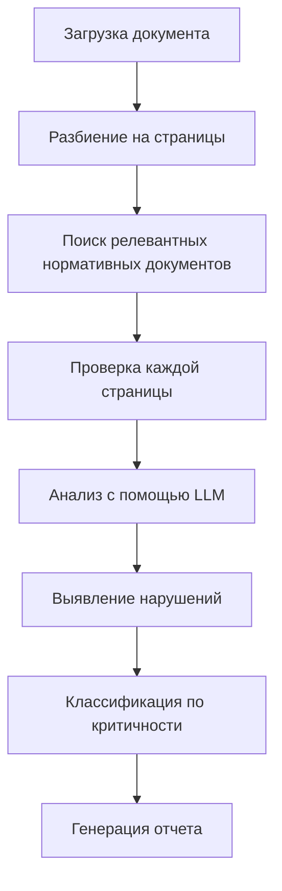

# ПАТЕНТНОЕ ОПИСАНИЕ ИЗОБРЕТЕНИЯ

## НАЗВАНИЕ ИЗОБРЕТЕНИЯ
**Система автоматизированной проверки нормативной документации с использованием искусственного интеллекта и векторного поиска**

## ОБЛАСТЬ ТЕХНИКИ
Изобретение относится к области автоматизации проектирования и строительства, а именно к системам автоматизированной проверки проектной документации на соответствие нормативным требованиям с использованием технологий искусственного интеллекта, машинного обучения и векторного поиска.

## ТЕХНИЧЕСКАЯ ПРОБЛЕМА
В настоящее время проверка проектной документации на соответствие нормативным требованиям (нормоконтроль) в строительстве и проектировании выполняется вручную экспертами, что приводит к следующим проблемам:

1. **Высокая трудоемкость** - требует значительных временных затрат квалифицированных специалистов
2. **Субъективность оценки** - результаты зависят от опыта и внимательности конкретного эксперта
3. **Неполнота проверки** - возможны пропуски нарушений из-за человеческого фактора
4. **Неэффективность поиска** - сложность поиска релевантных нормативных документов в обширной базе
5. **Отсутствие единых стандартов** - различные подходы к проверке у разных экспертов
6. **Высокая стоимость** - необходимость привлечения высококвалифицированных специалистов

## ТЕХНИЧЕСКОЕ РЕШЕНИЕ
Предлагается система **AI-Engineering/AI-NK**, представляющая собой интеллектуальную платформу для автоматизированной проверки проектной документации на соответствие нормативным требованиям, основанную на микросервисной архитектуре и использующую современные технологии искусственного интеллекта.

### ОСНОВНЫЕ КОМПОНЕНТЫ СИСТЕМЫ

#### 1. МИКРОСЕРВИСНАЯ АРХИТЕКТУРА
Система построена на основе микросервисной архитектуры, включающей следующие основные сервисы:

- **API Gateway** (порт 8443) - единая точка входа для всех API запросов
- **Document Parser** (порт 8001) - парсинг и обработка документов различных форматов
- **RAG Service** (порт 8003) - поиск по нормативной базе с использованием векторного поиска
- **Rule Engine** (порт 8002) - правила и логика проверки нормоконтроля
- **Calculation Service** (порт 8004) - выполнение инженерных расчетов
- **VLLM Service** (порт 8005) - интеграция с языковыми моделями
- **Spellchecker Service** (порт 8007) - проверка орфографии и грамматики
- **Outgoing Control Service** (порт 8006) - проверка исходящей корреспонденции
- **Frontend** (порт 443) - веб-интерфейс пользователя

#### 2. ТЕХНОЛОГИИ ИСКУССТВЕННОГО ИНТЕЛЛЕКТА

**2.1 Векторный поиск и RAG (Retrieval-Augmented Generation)**
- Использование модели **BGE-M3** для создания эмбеддингов документов
- Интеграция с векторной базой данных **Qdrant** для семантического поиска
- Гибридный поиск, сочетающий Dense Retrieval, BM25 и Reciprocal Rank Fusion (RRF)
- Поддержка PostgreSQL с расширением pgvector для векторных операций

**2.2 Большие языковые модели (LLM)**
- Интеграция с локальными моделями через **Ollama**
- Поддержка модели **GPT-OSS 20B** для анализа документов
- Использование **VLLM** для оптимизации работы с языковыми моделями
- Система промптов для специализированной проверки нормоконтроля

**2.3 Машинное обучение**
- Автоматическое извлечение признаков из документов
- Классификация нарушений по уровням критичности
- Обучение на исторических данных проверок
- Адаптивные алгоритмы улучшения точности

#### 3. ОБРАБОТКА ДОКУМЕНТОВ

**3.1 Поддерживаемые форматы**
- PDF (основной формат проектной документации)
- DOCX (текстовые документы)
- TXT (простые текстовые файлы)
- DWG, IFC (планируется поддержка)

**3.2 Алгоритм обработки**
1. **Загрузка документа** - проверка формата и размера
2. **Парсинг контента** - извлечение текста и структуры
3. **Чанкинг** - разбиение на семантически связанные фрагменты
4. **Создание эмбеддингов** - векторное представление фрагментов
5. **Индексация** - сохранение в векторной базе данных
6. **Метаданные** - сохранение информации о документе в PostgreSQL

#### 4. СИСТЕМА ПРОВЕРКИ НОРМОКОНТРОЛЯ

**4.1 Алгоритм проверки**

**4.2 Классификация нарушений**
- **Критические нарушения** (severity 4-5) - нарушения безопасности, несоответствие обязательным требованиям
- **Предупреждения** (severity 3) - незначительные нарушения, рекомендации по улучшению
- **Информационные замечания** (severity 1-2) - замечания по оформлению, рекомендации по оптимизации

**4.3 Нормативная база**
Система поддерживает следующие категории нормативных документов:
- **ГОСТ** - государственные стандарты
- **СП** - своды правил
- **СНиП** - строительные нормы и правила
- **Ведомственные** - ведомственные нормативы

#### 5. ИНЖЕНЕРНЫЕ РАСЧЕТЫ

Система включает модуль для выполнения 12 типов инженерных расчетов:

1. **Строительные конструкции** - расчеты балок, колонн, плит, фундаментов
2. **Основания и фундаменты** - несущая способность, осадки, устойчивость
3. **Теплотехнические расчеты** - теплопотери, теплоизоляция, конденсация
4. **Вентиляция и кондиционирование** - воздухообмен, дымоудаление, энергоэффективность
5. **Дегазация угольных шахт** - извлечение метана, требования вентиляции
6. **Электротехнические расчеты** - нагрузки, кабели, заземление, молниезащита
7. **Водоснабжение и водоотведение** - потребление воды, расчет трубопроводов
8. **Пожарная безопасность** - эвакуация, пожаротушение, дымоконтроль
9. **Акустические расчеты** - звукоизоляция, контроль шума, вибрации
10. **Освещение и инсоляция** - искусственное и естественное освещение
11. **Инженерно-геологические расчеты** - несущая способность грунтов, сейсмика
12. **Защита от БПЛА** - ударные волны, проникающая способность

#### 6. СИСТЕМА ОТЧЕТНОСТИ

**6.1 Генерация отчетов**
- Автоматическое создание PDF отчетов
- Детальная статистика проверки
- Визуализация результатов
- Экспорт в различные форматы

**6.2 Структура отчета**
- Общая информация о документе
- Статистика проверки
- Детальные результаты по страницам
- Список найденных нарушений
- Рекомендации по исправлению
- Заключение и общая оценка

#### 7. БЕЗОПАСНОСТЬ И АУТЕНТИФИКАЦИЯ

**7.1 Система аутентификации**
- Интеграция с **Keycloak** для управления пользователями
- Поддержка OAuth2/OIDC протоколов
- Ролевая модель доступа (admin, user)
- JWT токены для авторизации

**7.2 Безопасность данных**
- Шифрование данных в покое и при передаче
- HTTPS для всех соединений
- Изоляция сервисов в Docker контейнерах
- Логирование всех операций

#### 8. МОНИТОРИНГ И ЛОГИРОВАНИЕ

**8.1 Система мониторинга**
- **Prometheus** для сбора метрик
- **Grafana** для визуализации
- Health checks для всех сервисов
- Алерты при критических событиях

**8.2 Логирование**
- Структурированное логирование (JSON)
- Централизованный сбор логов
- Ротация логов
- Аудит операций пользователей

### ТЕХНИЧЕСКИЕ ХАРАКТЕРИСТИКИ

#### Производительность
- **Время обработки документа**: до 30 секунд для документа 100 страниц
- **Точность проверки**: Precision > 0.85, Recall > 0.90, F1-Score > 0.87
- **Пропускная способность**: до 100 документов в час
- **Масштабируемость**: горизонтальное масштабирование до 10 экземпляров сервиса

#### Системные требования
- **Минимальные**: 8GB RAM, 4 CPU cores, 50GB дискового пространства
- **Рекомендуемые**: 16GB RAM, 8 CPU cores, 100GB дискового пространства
- **Операционная система**: Linux (Ubuntu 20.04+), macOS (10.15+), Windows 10+

#### Поддерживаемые технологии
- **Backend**: Python 3.9+, FastAPI, PostgreSQL 15+, Redis 7+
- **Frontend**: React 18+, TypeScript, Material-UI
- **AI/ML**: Transformers, Sentence-Transformers, Qdrant, Ollama
- **Инфраструктура**: Docker, Docker Compose, Nginx

### ПРЕИМУЩЕСТВА ИЗОБРЕТЕНИЯ

1. **Автоматизация процесса** - полная автоматизация проверки нормоконтроля
2. **Высокая точность** - использование ИИ для выявления нарушений с точностью >85%
3. **Масштабируемость** - возможность обработки больших объемов документов
4. **Интеграция** - легкая интеграция с существующими системами проектирования
5. **Обучение** - система улучшается с каждым новым документом
6. **Стандартизация** - единые стандарты проверки для всех пользователей
7. **Экономия времени** - сокращение времени проверки в 10-20 раз
8. **Снижение затрат** - уменьшение потребности в экспертах-нормоконтролерах

### ОБЛАСТИ ПРИМЕНЕНИЯ

1. **Строительные организации** - проверка проектной документации
2. **Проектные институты** - автоматизация нормоконтроля
3. **Государственные органы** - экспертиза проектов
4. **Образовательные учреждения** - обучение студентов нормам проектирования
5. **Консалтинговые компании** - предоставление услуг по нормоконтролю

### НОВИЗНА И ИЗОБРЕТАТЕЛЬСКИЙ УРОВЕНЬ

**Новизна** заключается в создании первой в мире системы автоматизированной проверки нормативной документации в строительстве, использующей комбинацию:
- Векторного поиска для поиска релевантных нормативных документов
- Больших языковых моделей для анализа документов
- Микросервисной архитектуры для масштабируемости
- Интеграции с системами инженерных расчетов

**Изобретательский уровень** определяется тем, что специалист в данной области не мог бы очевидным образом получить заявленное техническое решение, поскольку:
- Не существует аналогов, объединяющих все указанные технологии
- Решение не следует из уровня техники
- Обеспечивает качественно новый результат

### ПРАКТИЧЕСКАЯ ПРИМЕНЯЕМОСТЬ

Изобретение может быть использовано в промышленности для:
- Автоматизации процессов нормоконтроля в строительстве
- Повышения качества проектной документации
- Сокращения времени и затрат на проверку документов
- Стандартизации процессов проверки
- Интеграции с существующими системами проектирования

### ЗАКЛЮЧЕНИЕ

Предлагаемое изобретение представляет собой комплексную систему автоматизированной проверки нормативной документации, которая решает актуальную техническую проблему повышения эффективности и качества нормоконтроля в строительстве и проектировании. Система основана на современных технологиях искусственного интеллекта и обеспечивает качественно новый уровень автоматизации процессов проверки документации.

---

**Дата составления**: 12 января 2025 года  
**Автор**: AI-Engineering Team  
**Версия**: 1.0  
**Статус**: Готово к подаче заявки на патент
